## Introduction to Kubernetes

[TOC]


### Welcome & Introduction  
**Course Learning Objectives**

- The origin, architecture, primary components, and building blocks of Kubernetes.

- How to set up and access a Kubernetes cluster using Minikube.

- Ways to run applications on the deployed Kubernetes environment, and access the deployed applications.

- The usefulness of Kubernetes communities, and how you can participate.

### Chapter 1. Container Orchestration
#### 1.1.1Introduction and Learning Objectives  
##### 1.1.1 Introduction
With container images, we confine the application code, its runtime, and all of its dependencies in a pre-defined format. And, with container runtimes like runC, containerd, or rkt we can use those pre-packaged images, to create one or more containers. All of these runtimes are good at running containers on a single host. But, in practice, we would like to have a fault-tolerant and scalable solution, which can be achieved by creating a single controller/management unit, after connecting multiple nodes together. This controller/management unit is generally referred to as a container orchestrator. 

In this chapter, we will explore why we should use container orchestrators, different implementations of container orchestrators, and where to deploy them

##### 1.1.2 Learning Objectives
- Define the concept of container orchestration.
- Explain the reasons for doing container orchestration.
- Discuss different container orchestration options.
- Discuss different container orchestration deployment options.

#### 1.2Container Orchestration  
##### 1.2.1 What Are Containers? 
Containers are an application-centric way to deliver high-performing, scalable applications on the infrastructure of your choice.
With a container image, we bundle the application along with its runtime and dependencies. We use that image to create an isolated executable environment, also known as container. We can deploy containers from a given image on the platform of our choice, such as desktops, VMs, cloud, etc.
##### 1.2.2 What Is Container Orchestration
In the quality assurance (QA) environments, we can get away with running containers on a single host to develop and test applications. However, when we go to production, we do not have the same liberty, as we need to ensure that our applications:
- Are fault-tolerant
- Can scale, and do this on-demand
- Use resources optimally
- Can discover other applications automatically, and communicate with each other
- Are accessible from the external world 
- Can update/rollback without any downtime. 

Container orchestrators are the tools which group hosts together to form a cluster, and help us fulfill the requirements mentioned above.

每个需求对应的k8s中的功能时什么？

##### 1.2.3 Container Orchestrators
- Docker Swarm
 Docker Swarm is a container orchestrator provided by Docker, Inc. It is part of Docker Engine.
- Kubernetes
Kubernetes was started by Google, but now, it is a part of the Cloud Native Computing Foundation project.
- Mesos Marathon
Marathon is one of the frameworks to run containers at scale on Apache Mesos.
- Amazon ECS
Amazon EC2 Container Service (ECS) is a hosted service provided by AWS to run Docker containers at scale on its infrastructrue.
- Hashicorp Nomad
Nomad is the container orchestrator provided by HashiCorp.

##### 1.2.4 Why Use Container Orchestrators?

Container orchestrators can:

- Bring multiple hosts together and make them part of a cluster
- Schedule containers to run on different hosts
- Help containers running on one host reach out to containers running on other hosts in the cluster
- Bind containers and storage
- Bind containers of similar type to a higher-level construct, like services, so we don't have to deal with individual containers
- Keep resource usage in-check, and optimize it when necessary
- Allow secure access to applications running inside containers.
With all these built-in benefits, it makes sense to use container orchestrators to manage containers. In this course, we will explore Kubernetes. 

##### 1.2.5 Where to Deploy Container Orchestrators
Most container orchestrators can be deployed on the infrastructure of our choice. We can deploy them on bare metal, VMs, on-premise, or on a cloud of our choice. For example, Kubernetes can be deployed on our laptop/workstation, inside a company's datacenter, on AWS, on OpenStack, etc. There are even one-click installers available to set up Kubernetes on the cloud, like Google Kubernetes Engine on Google Cloud, or Azure Container Service on Microsoft Azure. Similar solutions are available for other container orchestrators, as well.

There are companies that offer managed Container Orchestration as a Service. We will explore them for Kubernetes in one of the later chapters

### Chapter 2. Kubernetes 
####  2.1Introduction and Learning Objectives  
##### 2.1.1 Introduction
In this chapter, we will explain what Kubernetes is, its features, and the reasons why one should use it. We will explore the evolution of Kubernetes from Borg, which is a cluster manager created by Google. 

We will also talk about the Cloud Native Computing Foundation (CNCF), which currently hosts the Kubernetes project, along with other cloud-native projects, like Prometheus, Fluentd, rkt, containerd, etc. 
##### 2.1.2 Learning Objectives
- Define Kubernetes.
- Explain the reasons for using Kubernetes.
- Discuss the features of Kubernetes.
- Discuss the evolution of Kubernetes from Borg.
- Explain what the Cloud Native Computing Foundation does.

#### 2.2 Kubernetes  
##### 2.2.1 What Is Kubernetes?
According to the Kubernetes website,

"Kubernetes is an open-source system for automating deployment, scaling, and management of containerized applications."

Kubernetes comes from the Greek word κυβερνήτης:, which means helmsman or ship pilot. With this analogy in mind, we can think of Kubernetes as the manager for shipping containers.

Generally, Kubernetes has new releases every three months. 
##### 2.2.2 From Borg to Kubernetes

some of the features/objects of Kubernetes that can be traced back to Borg, or to lessons learnt from it, are:

- API servers
- Pods
- IP-per-Pod
- Services
- Labels.

##### 2.2.3 Kubernetes Features I
Kubernetes offers a very rich set of features for container orchestration. Some of its fully supported features are:

- Automatic binpacking
Kubernetes automatically schedules the containers based on resource usage and constraints, without sacrificing the availability.

- Self-healing
Kubernetes automatically replaces and reschedules the containers from failed nodes. It also kills and restarts the containers which do not respond to health checks, based on existing rules/policy.

- Horizontal scaling
Kubernetes can automatically scale applications based on resource usage like CPU and memory. In some cases, it also supports dynamic scaling based on customer metrics.

- Service discovery and Load balancing
Kubernetes groups sets of containers and refers to them via a Domain Name System (DNS). This DNS is also called a Kubernetes service. Kubernetes can discover these services automatically, and load-balance requests between containers of a given service.

#####2.2.4 Kubernetes Features II
some other fully supported Kubernetes features are:
- Automated rollouts and rollbacks
Kubernetes can roll out and roll back new versions/configurations of an application, without introducing any downtime.
- Secrets and configuration management
Kubernetes can manage secrets and configuration details for an application without re-building the respective images. With secrets, we can share confidential information to our application without exposing it to the stack configuration, like on GitHub.
- Storage orchestration
With Kubernetes and its plugins, we can automatically mount local, external, and storage solutions to the containers in a seamless manner, based on software-defined storage (SDS).
- Batch execution
Besides long running jobs, Kubernetes also supports batch execution.

##### 2.2.5 Why Use Kubernetes
- We just looked at some of the fully-supported Kubernetes features. 
- We should also mention that Kubernetes is very portable and extensible. 
- Kubernetes can be deployed on the environment of our choice, be it VMs, bare metal, or public/private/hybrid/multi-cloud setups. Also, 
- Kubernetes has a very modular and pluggable architecture. We can write custom APIs or plugins to extend its functionalities.

For a successful open source project, the community is as important as having great code. Kubernetes has a very thriving community across the world. It has more than 1600 contributors, who, over time, have done over 62,000 commits. There are meet-up groups in different cities which meet regularly to discuss Kubernetes and its ecosystem. There are Special Interest Groups (SIGs), which focus on special interests, such as scaling, bare metal, networking, etc. We will talk more about them in our last chapter, Kubernetes Communities.

##### 2.2.6 Cloud Native Computing Foundation (CNCF)
The Cloud Native Computing Foundation (CNCF) is one of the projects hosted by The Linux Foundation. CNCF aims to accelerate the adoption of containers, microservices, and cloud-native applications.
CNCF hosts a set of projects, with more to be added in the future. CNCF provides resources to each of the projects, but, at the same time, each project continues to operate independently under its pre-existing governance structure and with its existing maintainers. At the time this course was created, the following projects were part of CNCF:

- containerd for container runtime
- rkt for container runtime
- Kubernetes for container orchestration
- Linkerd for service mesh
- Envoy for service mesh
- gRPC for remote procedure call (RPC)
- Container Network Interface (CNI) for networking API
- CoreDNS for service discovery
- Rook for cloud-native storage
- Notary for security
- The Update Framework (TUF) for software updates
- Prometheus for monitoring
- OpenTracing for tracing
- Jaeger for distributed tracing
- Fluentd for logging
- Vitess for storage.


 As we can see, this set of CNCF projects can cover the entire lifecycle of an application, from its execution using container runtimes, to its monitoring and logging. This is very important to meet the CNCF goal.

##### 2.2.7 CNCF and Kubernetes
For Kubernetes, the Cloud Native Computing Foundation:

- Provides a neutral home for the Kubernetes trademark and enforces proper usage
- Provides license scanning of core and vendored code
- Offers legal guidance on patent and copyright issues
-Creates open source curriculum, training, and certification
- Manages a software conformance working group
- Actively markets Kubernetes
- Hosts and funds developer marketing activities like K8Sport
- Supports ad hoc activities
- Funds conferences and meetup events.

### Chapter 3. Kubernetes Architecture - Overview  
#### 3.1 Introduction and Learning Objectives
##### 3.1.1 Introduction 
In this chapter, we will explore the Kubernetes architecture, the different components of the master and worker nodes, the cluster state management with etcd and the network setup requirements. We will also talk about the network specification called Container Network Interface (CNI), which is used by Kubernetes. 
##### 3.1.2 Learning Objectives
By the end of this chapter, you should be able to:

- Discuss the Kubernetes architecture.
- Explain the different components for master and worker nodes.
- Discuss about cluster state management with etcd.
- Review the Kubernetes network setup requirements.


#### 3.2 Kubernetes Architecture - Overview  
##### 3.2.1 Kubernetes Architecture
At a very high level, Kubernetes has the following main components:

One or more master nodes
One or more worker nodes
Distributed key-value store, like etcd.

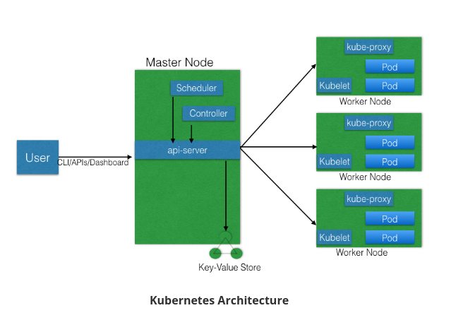

##### 3.2.2 Master Node
The master node is responsible for managing the Kubernetes cluster, and it is the entry point for all administrative tasks. We can communicate to the master node via the CLI, the GUI (Dashboard), or via APIs.

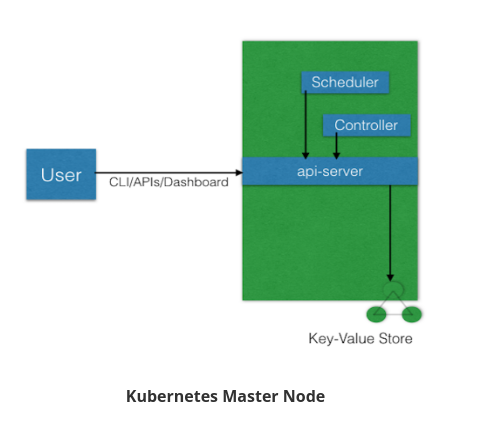

For fault tolerance purposes, there can be more than one master node in the cluster. If we have more than one master node, they would be in a HA (High Availability) mode, and only one of them will be the leader, performing all the operations. The rest of the master nodes would be followers.

To manage the cluster state, Kubernetes uses etcd, and all master nodes connect to it. etcd is a distributed key-value store, which we will discuss in a little bit. The key-value store can be part of the master node. It can also be configured externally, in which case, the master nodes would connect to it.

##### 3.2.3 Master Node Components
A master node has the following components:

API server
Scheduler
Controller manager
etcd.
In the next few sections, we will discuss them in more detail.

##### 3.2.4 Master Node Components: API Server
All the administrative tasks are performed via the API server within the master node. A user/operator sends REST commands to the API server, which then validates and processes the requests. After executing the requests, the resulting state of the cluster is stored in the distributed key-value store.

##### 3.2.5 Master Node Components: Scheduler
As the name suggests, the scheduler schedules the work to different worker nodes. The scheduler has the resource usage information for each worker node. It also knows about the constraints that users/operators may have set, such as scheduling work on a node that has the label disk==ssd set. Before scheduling the work, the scheduler also takes into account the quality of the service requirements, data locality, affinity, anti-affinity, etc. The scheduler schedules the work in terms of Pods and Services.

##### 3.2.6 Master Node Components: Controller Manager
The controller manager manages different non-terminating control loops, which regulate the state of the Kubernetes cluster. Each one of these control loops knows about the desired state of the objects it manages, and watches their current state through the API server. In a control loop, if the current state of the objects it manages does not meet the desired state, then the control loop takes corrective steps to make sure that the current state is the same as the desired state.

##### 3.2.7 Master Node Components: etcd
As discussed earlier, etcd is a distributed key-value store which is used to store the cluster state. It can be part of the Kubernetes Master, or, it can be configured externally, in which case, master nodes would connect to it.

##### 3.2.8 Worker Node
A worker node is a machine (VM, physical server, etc.) which runs the applications using Pods and is controlled by the master node. Pods are scheduled on the worker nodes, which have the necessary tools to run and connect them. A Pod is the scheduling unit in Kubernetes. It is a logical collection of one or more containers which are always scheduled together. We will explore them further in later chapters.
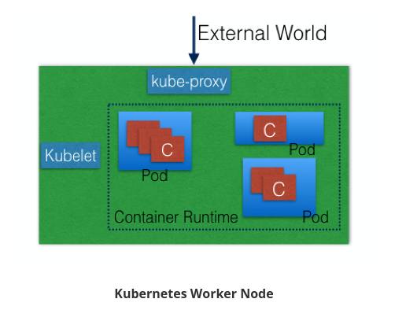

Also, to access the applications from the external world, we connect to worker nodes and not to the master node/s. We will dive deeper into this in future chapters. 

##### 3.2.9 Worker Node Components
A worker node has the following components:

- Container runtime
- kubelet
- kube-proxy

##### 3.2.10 Worker Node Components: Container Runtime
To run and manage a container's lifecycle, we need a container runtime on the worker node. Some examples of container runtimes are: 

- containerd
- rkt
- lxd. 
Sometimes, Docker is also referred to as a container runtime, but to be precise, Docker is a platform which uses containerd as a container runtime. 

##### 3.2.11 Worker Node Components: kubelet
The kubelet is an agent which runs on each worker node and communicates with the master node. It receives the Pod definition via various means (primarily, through the API server), and runs the containers associated with the Pod. It also makes sure that the containers which are part of the Pods are healthy at all times.

The kubelet connects to the container runtime using Container Runtime Interface (CRI). The Container Runtime Interface consists of protocol buffers, gRPC API, and libraries. 
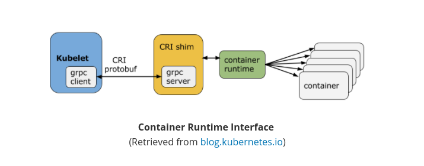
As shown above, the kubelet (grpc client) connects to the CRI shim (grpc server) to perform container and image operations. CRI implements two services: ImageService and RuntimeService. The ImageService is responsible for all the image-related operations, while the RuntimeService is responsible for all the Pod and container-related operations.

Container runtimes used to be hard-coded in Kubernetes, but with the development of CRI, Kubernetes can now use different container runtimes without the need to recompile. Any container runtime that implements CRI can be used by Kubernetes to manage Pods, containers, and container images.

##### 3.2.12 Worker Node Components: kubelet: CRI shims
Below you will find some examples of CRI shims:

- dockershim
With dockershim, containers are created using Docker installed on the worker nodes. Internally, Docker uses containerd to create and manage containers.


- cri-containerd
With cri-containerd, we can directly use Docker's smaller offspring containerd to create and manage containers.

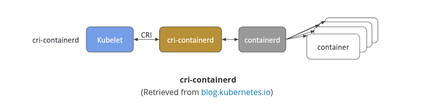


- CRI-O
CRI-O enables using any Open Container Initiative (OCI) compatible runtimes with Kubernetes. At the time this course was created, CRI-O supported runC and Clear Containers as container runtimes. However, in principle, any OCI-compliant runtime can be plugged-in.


##### 3.2.13 Worker Node Components: kube-proxy
Instead of connecting directly to Pods to access the applications, we use a logical construct called a Service as a connection endpoint. A Service groups related Pods and, when accessed, load balances to them. We will talk more about Services in later chapters.

kube-proxy is the network proxy which runs on each worker node and listens to the API server for each Service endpoint creation/deletion. For each Service endpoint, kube-proxy sets up the routes so that it can reach to it. We will also explore this in more detail in later chapters.

##### 3.2.14 State Management with etcd
As we mentioned earlier, Kubernetes uses etcd to store the cluster state. etcd is a distributed key-value store based on the Raft Consensus Algorithm. Raft allows a collection of machines to work as a coherent group that can survive the failures of some of its members. At any given time, one of the nodes in the group will be the master, and the rest of them will be the followers. Any node can be treated as a master.

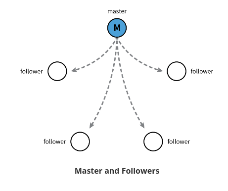

etcd is written in the Go programming language. In Kubernetes, besides storing the cluster state, etcd is also used to store configuration details such as subnets, ConfigMaps, Secrets, etc. 

##### 3.2.15 Network Setup Challenges
To have a fully functional Kubernetes cluster, we need to make sure of the following:

- A unique IP is assigned to each Pod
- Containers in a Pod can communicate to each other
- The Pod is able to communicate with other Pods in the cluster
- If configured, the application deployed inside a Pod is accessible from the external world.

All of the above are networking challenges which must be addressed before deploying the Kubernetes cluster. Next, we will see how we can solve these challenges.

##### 3.2.16 Assigning a Unique IP Address to Each Pod
In Kubernetes, each Pod gets a unique IP address. For container networking, there are two primary specifications:

- Container Network Model (CNM), proposed by Docker
- Container Network Interface (CNI), proposed by CoreOS.
Kubernetes uses CNI to assign the IP address to each Pod.


The container runtime offloads the IP assignment to CNI, which connects to the underlying configured plugin, like Bridge or MACvlan, to get the IP address. Once the IP address is given by the respective plugin, CNI forwards it back to the requested container runtime.

##### 3.2.17 Container-to-Container Communication Inside a Pod

With the help of the underlying host operating system, all of the container runtimes generally create an isolated network entity for each container that it starts. On Linux, that entity is referred to as a **network namespace**. These network namespaces can be shared across containers, or with the host operating system.

##### 3.2.18 Pod-to-Pod Communication Across Nodes

In a clustered environment, the Pods can be scheduled on any node. We need to make sure that the Pods can communicate across the nodes, and all the nodes should be able to reach any Pod. Kubernetes also puts a condition that there shouldn't be any Network Address Translation (NAT) while doing the Pod-to-Pod communication across hosts. We can achieve this via:

- Routable Pods and nodes, using the underlying physical infrastructure, like Google Kubernetes Engine

- Using Software Defined Networking, like [Flannel](https://coreos.com/flannel/docs/latest/), [Weave](https://www.weave.works/oss/net/), [Calico](https://www.projectcalico.org/), etc. 

For more details, you can take a look at the available [Kubernetes documentation](https://kubernetes.io/docs/concepts/cluster-administration/networking/).

##### 3.2.19 Communication Between the External World and Pods

By exposing our services to the external world with **kube-proxy**, we can access our applications from outside the cluster. We will have a complete chapter dedicated to this, so we will dive into this later.

### 4. Installing Kubernetes

#### 4.1 Introduction

In this chapter, we will first discuss about the different configurations in which Kubernetes can be installed. We will then discuss about the infrastructure requirements to install Kubernetes, and we will also look at some of the tools which can help us with the installation. 

#### 4.2 Learning Objectives

By the end of this chapter, you should be able to:


- Discuss about the different Kubernetes configuration options.
- Discuss infrastructure considerations before installing Kubernetes.
- Discuss infrastructure choices for a Kubernetes deployment.
- Review Kubernetes installation tools and resources.

#### 4.3 Installing Kubernetes  

##### 4.3.1 Kubernetes Configuration

Kubernetes can be installed using different configurations. The four major installation types are briefly presented below:

- **All-in-One Single-Node Installation**
  With all-in-one, all the master and worker components are installed on a single node. This is very useful for learning, development, and testing. This type should not be used in production. Minikube is one such example, and we are going to explore it in future chapters.
- **Single-Node etcd, Single-Master, and Multi-Worker Installation**
  In this setup, we have a single master node, which also runs a single-node etcd instance. Multiple worker nodes are connected to the master node.
- **Single-Node etcd, Multi-Master, and Multi-Worker Installation**
  In this setup, we have multiple master nodes, which work in an HA mode, but we have a single-node etcd instance. Multiple worker nodes are connected to the master nodes.
- **Multi-Node etcd, Multi-Master, and Multi-Worker Installation**
  In this mode, etcd is configured in a clustered mode, outside the Kubernetes cluster, and the nodes connect to it. The master nodes are all configured in an HA mode, connecting to multiple worker nodes. This is the most advanced and recommended production setup.

##### 4.3.2 Infrastructure for Kubernetes Installation

Once we decide on the installation type, we also need to make some infrastructure-related decisions, such as:

- Should we set up Kubernetes on bare metal, public cloud, or private cloud?

- Which underlying system should we use? Should we choose RHEL, CoreOS, CentOS, or something else?
 Which networking solution should we use?
- And so on.

The Kubernetes documentation has details in regards to [choosing the right solution](https://kubernetes.io/docs/setup/pick-right-solution/). Next, we will take a closer look at these solutions.

##### 4.3.4 Localhost Installation

There are a few localhost installation options available to deploy single- or multi-node Kubernetes clusters on our workstation/laptop:

- [Minikube](https://kubernetes.io/docs/getting-started-guides/minikube/)
- [Ubuntu on LXD](https://kubernetes.io/docs/getting-started-guides/ubuntu/local/).

Minikube is the preferred and recommended way to create an all-in-one Kubernetes setup. We will be using it extensively in this course.

##### 4.3.5 On-Premise Installation

Kubernetes can be installed on-premise on VMs and bare metal.

- **On-Premise VMs**
  Kubernetes can be installed on VMs created via Vagrant, VMware vSphere, KVM, etc. There are different tools available to automate the installation, like [Ansible](https://www.ansible.com/) or [kubeadm](https://github.com/kubernetes/kubeadm).
- **On-Premise Bare Metal**Kubernetes can be installed on on-premise bare metal, on top of different operating systems, like RHEL, CoreOS, CentOS, Fedora, Ubuntu, etc. Most of the tools used to install VMs can be used with bare metal as well. 

##### 4.3.6 Cloud Installation

Kubernetes can be installed and managed on almost any cloud environment:

- **Hosted Solutions**With hosted solutions, any given software is completely managed by the provider. The user will just need to pay hosting and management charges. Some examples of vendors providing hosted solutions for Kubernetes are listed below:

  - [Google Kubernetes Engine (GKE)](https://cloud.google.com/container-engine/)
  -  [Azure Container Service (AKS)](https://azure.microsoft.com/en-us/services/container-service/)
  - [Amazon Elastic Container Service for Kubernetes (EKS) - Currently in Tech Preview](https://aws.amazon.com/eks/)
  - [OpenShift Dedicated](https://www.openshift.com/dedicated/)
  - [Platform9](https://platform9.com/support/kubernetes-at-the-command-line-up-and-running-with-kubectl/)
  - [IBM Cloud Container Service](https://console.ng.bluemix.net/docs/containers/container_index.html).

-**Turnkey Cloud Solutions**For Kubernetes, we have some Turnkey Cloud Solutions, with which Kubernetes can be installed with just a few commands on an underlying IaaS platform, such as:

  - [Google Compute Engine](https://kubernetes.io/docs/getting-started-guides/gce/)
  - [Amazon AWS](https://kubernetes.io/docs/getting-started-guides/aws/)
  - [Microsoft Azure](https://kubernetes.io/docs/getting-started-guides/azure/)
  - [Tectonic by CoreOS](https://coreos.com/tectonic).

- **Bare Metal**Kubernetes can be installed on bare metal provided by different cloud providers.

##### 4.3.7 Kubernetes Installation Tools/Resources

   -  **kubeadm**
      [kubeadm](https://github.com/kubernetes/kubeadm) is a first-class citizen on the Kubernetes ecosystem. It is a secure and recommended way to bootstrap the Kubernetes cluster. It has a set of building blocks to setup the cluster, but it is easily extendable to add more functionality. Please note that kubeadm does not support the provisioning of machines.
    - **KubeSpray**
      With [KubeSpray](https://github.com/kubernetes-incubator/kubespray) (formerly known as Kargo), we can install Highly Available Kubernetes clusters on AWS, GCE, Azure, OpenStack, or bare metal. KubeSpray is based on Ansible, and is available on most Linux distributions. It is a [Kubernetes Incubator](https://github.com/kubernetes-incubator/kargo) project.
    - **Kops**
      With [Kops](https://github.com/kubernetes/kops), we can create, destroy, upgrade, and maintain production-grade, highly-available Kubernetes clusters from the command line. It can provision the machines as well. Currently, AWS is officially supported. Support for GCE and VMware vSphere are in alpha stage, and other platforms are planned for the future.

If the existing solutions and tools do not fit your requirements, then [you can always install Kubernetes from scratch](https://kubernetes.io/docs/getting-started-guides/scratch/).

It is worth checking out the *Kubernetes The Hard Way* GitHub project by [Kelsey Hightower](https://twitter.com/kelseyhightower), which shares the manual steps involved in bootstrapping a Kubernetes cluster.


### 5. Setting Up a Single-Node Kubernetes Cluster with Minikube  

#### 5.1 Introduction and Learning Objectives  

##### 5.1.1  Introduction

As we mentioned in the previous chapter, Minikube is the easiest and most recommended way to run an all-in-one Kubernetes cluster locally. In this chapter, we will check out the requirements to install Minikube on our workstation, as well as the installation instructions to set it up on Linux, Mac, and Windows. 

##### 5.1.2  Learning Objectives

By the end of this chapter, you should be able to:

- Discuss Minikube.

- Install Minikube on Linux, Mac, and Windows.

- Verify the installation


###  6. Accessing Minikube

#### 6.1 Introduction and Learning Objectives  

##### 6.1.1 Introduction

Introductionz

In this chapter, we will study the different access methods to any Kubernetes cluster. We will use **kubectl** to access Minikube via **CLI**, the Kubernetes dashboard to access it via **GUI**, and the curl command, with the right credentials to access it via **APIs**.s

##### 6.1.2 API

By the end of this chapter, you should be able to:

- Review methods to access any Kubernetes cluster.
- Configure kubectl for Linux, macOS, and Windows.
- Access the Minikube dashboard.
- Access Minikube via APIs.

#### 6.2 Accessing Minikube  

##### 6.2.1 Accessing Minikube

Any healthy running Kubernetes cluster can be accessed via one of the following methods:

- Command Line Interface (CLI)
- Graphical User Interface (GUI)
- APIs.
  These methods are applicable to all Kubernetes clusters. 

##### 6.2.2 Accessing Minikube: Command Line Interface (CLI)

kubectl is the Command Line Interface (CLI) tool to manage the Kubernetes cluster resources and applications. In later chapters, we will be using kubectl to deploy the applications and manage the Kubernetes resources.

##### 6.2.3 Accessing Minikube: Graphical User Interface (GUI)

The Kubernetes dashboard provides the **Graphical User Interface (GUI)** to interact with its resources and containerized applications. In one of the later chapters, we will be using it to deploy a containerized application.

##### 6.2.4 Accessing Minikube: APIs

As we know, Kubernetes has the API server, and operators/users connect to it from the external world to interact with the cluster. Using both CLI and GUI, we can connect to the API server on the master node to perform different operations. We can directly connect to the API server using its API endpoints and send commands to it, as long as we can access the master node and have the right credentials.

Below, you can find a part of the HTTP API space of Kubernetes:

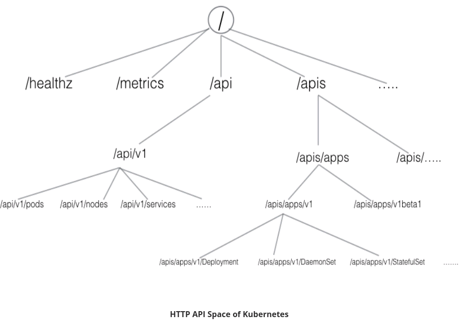

HTTP API space of Kubernetes can be divided into three independent groups:

- Core Group (/api/v1)
  This group includes objects such as Pods, Services, nodes, etc.
- Named Group
  This group includes objects in /apis/$NAME/$VERSION format. These different API versions imply different levels of stability and support:
  Alpha level - it may be dropped at any point in time, without notice. For example, /apis/batch/v2alpha1.
  Beta level - it is well-tested, but the semantics of objects may change in incompatible ways in a subsequent beta or stable release. For example, /apis/certificates.k8s.io/v1beta1.
  Stable level - appears in released software for many subsequent versions. For example, /apis/networking.k8s.io/v1.
- System-wide
  This group consists of system-wide API endpoints, like /healthz, /logs, /metrics, /ui, etc.

We can either connect to an API server directly via calling the respective API endpoints, or via the CLI/GUI.

Next, we will see how we can access the Minikube environment we set up in the previous chapter.

##### 6.2.5 kubectl

kubectl is generally installed before installing Minikube, but we can also install it later. There are different methods that can be used to install kubectl, which are mentioned in the Kubernetes documentation. Next, we will look at the steps to install kubectl on Linux, macOS, and Windows systems.

##### 6.2.6  Installing kubectl on Linux

To install kubectl on Linux, follow the instructions below:

Download the latest stable kubectl binary

$ curl -LO https://storage.googleapis.com/kubernetes-release/release/$(curl -s https://storage.googleapis.com/kubernetes-release/release/stable.txt)/bin/linux/amd64/kubectl

Make the kubectl binary executable

$ chmod +x ./kubectl

Move the kubectl binary to the PATH

$ sudo mv ./kubectl /usr/local/bin/kubectl

##### 6.2.7 Installing kubectl on macOS

Use the following command

$ brew install kubectl

##### 6.2.8 kubectl Configuration File

To connect to the Kubernetes cluster, kubectl needs the master node endpoint and the credentials to connect to it. While starting Minikube, the startup process creates, by default, a configuration file, config, inside the.kube directory, which resides in the user's home directory. That configuration file has all the connection details. By default, the kubectl binary accesses this file to find the master node's connection endpoint, along with the credentials. To look at the connection details, we can either see the content of the ~/.kube/config(Linux) file, or run the following command:

$ kubectl config view
apiVersion: v1
clusters:
- cluster:
  certificate-authority: /Users/nkhare/.minikube/ca.crt
  server: https://192.168.99.100:8443
  name: minikube
  contexts:
- context:
  cluster: minikube
  user: minikube
  name: minikube
  current-context: minikube
  kind: Config
  preferences: {}
  users:
- name: minikube
  user:
    client-certificate: /Users/nkhare/.minikube/apiserver.crt
    client-key: /Users/nkhare/.minikube/apiserver.key

Once kubectl is installed, we can get information about the Minikube cluster with the kubectl cluster-info command: 

$ kubectl cluster-info
Kubernetes master is running at https://192.168.99.100:8443

To further debug and diagnose cluster problems, use 'kubectl cluster-info dump'.

You can find more details about the kubectl command line options here.


##### 6.2.9 Using the 'minikube dashboard' Command

As mentioned earlier, the Kubernetes dashboard provides the user interface for the Kubernetes cluster. To access the dashboard of Minikube, we can use minikube dashboard, which would open a new tab on our web browser, displaying the Kubernetes dashboard:

$ minikube dashboard


##### 6.2.10 Using the 'kubectl proxy' Command


Using the kubectl proxy command, kubectl would authenticate with the API server on the master node and would make the dashboard available on http://127.0.0.1:8001/api/v1/namespaces/kube-system/services/kubernetes-dashboard:/proxy/#!/overview?namespace=default, as the kubernetes-dashboard service runs inside the kube-system namespace.

$ kubectl proxy
Starting to serve on 127.0.0.1:8001

After running the above command, we can access the dashboard at http://127.0.0.1:8001/api/v1/namespaces/kube-system/services/kubernetes-dashboard:/proxy/#!/overview?namespace=default.


With the above curl request, we requested all the API endpoints from the API server.


### 7. Kubernetes Building Blocks  

#### 7.1 Introduction and Learning Objectives  

##### 7.1.1 Introduction

In this chapter, we will explore the Kubernetes object model and discuss some of its building blocks, such as Pods, ReplicaSets, Deployments, Namespaces, etc. We will also discuss the role of Labels and Selectors when it comes to grouping objects together. 

##### 7.1.2 Learning Objectives

By the end of this chapter, you should be able to:

- Review the Kubernetes object model.
- Discuss Kubernetes building blocks, e.g. Pods, ReplicaSets, Deployments, Namespaces.
- Discuss Labels and Selectors.

#### 7.2 Kubernetes Building Blocks  

##### 7.2.1 Kubernetes Object Model


Kubernetes has a very rich object model, with which it represents different persistent entities in the Kubernetes cluster. Those entities describe:

- What containerized applications we are running and on which node

- Application resource consumption

- Different policies attached to applications, like restart/upgrade policies, fault tolerance, etc.


With each object, we declare our intent or desired state using the spec field. The Kubernetes system manages the status field for objects, in which it records the actual state of the object. At any given point in time, the Kubernetes Control Plane tries to match the object's actual state to the object's desired state.

Examples of Kubernetes objects are Pods, ReplicaSets, Deployments, Namespaces, etc. We will explore them next.

To create an object, we need to provide the spec field to the Kubernetes API server. The spec field describes the desired state, along with some basic information, like the name. The API request to create the object must have the spec field, as well as other details, in a JSON format. Most often, we provide an object's definition in a.yaml file, which is converted by kubectl in a JSON payload and sent to the API server.

Below is an example of a Deployment object:

```yaml
apiVersion: apps/v1

kind: Deployment

metadata:

  name: nginx-deployment

  labels:

    app: nginx

spec:

  replicas: 3

  selector:

    matchLabels:

      app: nginx

  template:

    metadata:

      labels:

        app: nginx

    spec:

      containers:

      - name: nginx

        image: nginx:1.7.9

        ports:

        - containerPort: 80
```

With the apiVersion field in the example above, we mention the API endpoint on the API server which we want to connect to. With the kind field, we mention the object type - in our case, we have Deployment. With the metadata field, we attach the basic information to objects, like the name. You may have noticed that in our example we have two spec fields (spec and spec.template.spec). With spec, we define the desired state of the deployment. In our example, we want to make sure that, at any point in time, at least 3 Pods are running, which are created using the Pods Template defined in spec.template. In spec.template.spec, we define the desired state of the Pod. Here, our Pod would be created using nginx:1.7.9.

Once the object is created, the Kubernetes system attaches the status field to the object; we will explore it later.

Next, we will take a closer look at some of the Kubernetes objects, along with other building blocks.


##### 7.2.2 Pods

A Pod is the smallest and simplest Kubernetes object. It is the unit of deployment in Kubernetes, which represents a single instance of the application. A Pod is a logical collection of one or more containers, which:

- Are scheduled together on the same host
- Share the same network namespace
- Mount the same external storage (volumes).

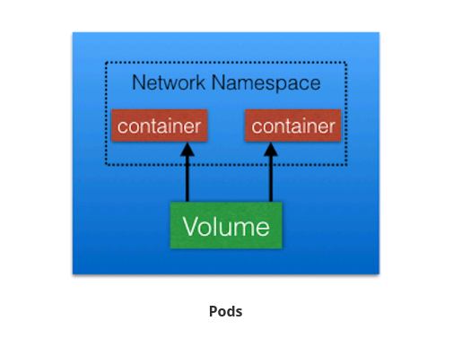

Pods are **ephemeral in nature**, and they do not **have the capability to self-heal** by themselves. That is why we use them with controllers, **which can handle a Pod's replication, fault tolerance, self-heal**, etc. Examples of controllers are Deployments, ReplicaSets, ReplicationControllers, etc. We attach the Pod's specification to other objects using Pods Templates, as we have seen in the previous section.


##### 7.2.3 Labels

Labels are key-value pairs that can be attached to any Kubernetes objects (e.g. Pods). Labels are used to organize and select a subset of objects, based on the requirements in place. Many objects can have the same Label(s). Labels do not provide uniqueness to objects.

  

In the image above, we have used two Labels: app and env. Based on our requirements, we have given different values to our four Pods.

##### 7.2.4 Label Selectors

With Label Selectors, we can select a subset of objects. Kubernetes supports two types of Selectors:

- Equality-Based Selectors
  Equality-Based Selectors allow filtering of objects based on Label keys and values. With this type of selectors, we can use the =, ==, or != operators. For example, with env==dev we are selecting the objects where the env Label is set to dev. 
- Set-Based Selectors
  Set-Based Selectors allow filtering of objects based on a set of values. With this type of Selectors, we can use the in, notin, and exist operators. For example, with env in (dev,qa), we are selecting objects where the env Label is set to dev or qa.


##### 7.2.5 ReplicationControllers

A ReplicationController (rc) is a controller that is part of the master node's controller manager. It makes sure the specified number of replicas for a Pod is running at any given point in time. If there are more Pods than the desired count, the ReplicationController would kill the extra Pods, and, if there are less Pods, then the ReplicationController would create more Pods to match the desired count. **Generally, we don't deploy a Pod independently, as it would not be able to re-start itself, if something goes wrong**. We always use controllers like ReplicationController to create and manage Pods. 

##### 7.2.6 ReplicaSets 

A ReplicaSet (rs) is the next-generation ReplicationController. ReplicaSets support both equality- and set-based selectors, whereas ReplicationControllers only support equality-based Selectors. Currently, this is the only difference.

Next, you can see a graphical representation of a ReplicaSet, where we have set the replica count to 3 for a Pod.


A ReplicaSet (rs) is the next-generation ReplicationController. ReplicaSets support both equality- and set-based selectors, whereas ReplicationControllers only support equality-based Selectors. Currently, this is the only difference.

Next, you can see a graphical representation of a ReplicaSet, where we have set the replica count to 3 for a Pod.

The ReplicaSet will detect that the current state is no longer matching the desired state. So, in our given scenario, the ReplicaSet will create one more Pod, thus ensuring that the current state matches the desired state.


ReplicaSets can be used independently, but they are mostly used by Deployments to orchestrate the Pod creation, deletion, and updates. A Deployment automatically creates the ReplicaSets, and we do not have to worry about managing them. 

We will take a closer look at Deployments next.

##### 7.2.7 Deployments

Deployment objects provide declarative updates to Pods and ReplicaSets. The DeploymentController is part of the master node's controller manager, and it makes sure that the current state always matches the desired state.

In the following example, we have a Deployment which creates a ReplicaSet A. ReplicaSet A then creates 3 Pods. In each Pod, one of the containers uses the nginx:1.7.9 image.


Now, in the Deployment, we change the Pods Template and we update the image for the nginx container from nginx:1.7.9 to nginx:1.9.1. As have modified the Pods Template, a new ReplicaSet B gets created. This process is referred to as a Deployment rollout.

**A rollout is only triggered when we update the Pods Template for a deployment.** Operations like scaling the deployment do not trigger the deployment.

Once ReplicaSet B is ready, the Deployment starts pointing to it.


On top of ReplicaSets, **Deployments provide features like Deployment recording,** with which, if something goes wrong, we can rollback to a previously known state.


##### 7.2.8 Namespaces


If we have numerous users whom we would like to organize into teams/projects, we can partition the Kubernetes cluster into sub-clusters using Namespaces. The names of the resources/objects created inside a Namespace are unique, but not across Namespaces.

To list all the Namespaces, we can run the following command:

$ kubectl get namespaces
NAME          STATUS       AGE
default       Active       11h
kube-public   Active       11h
kube-system   Active       11h

Generally, Kubernetes creates two default Namespaces: kube-system and default. The **kube-system** Namespace contains the objects created by the Kubernetes system. The default Namespace contains the objects which belong to any other Namespace. By default, we connect to the default Namespace. **kube-public** is a special Namespace, which is readable by all users and used for special purposes, like bootstrapping a cluster. 

Using **Resource Quotas**, we can divide the cluster resources within Namespaces. We will briefly cover resource quotas in one of the future chapters.


### 8. Authentication, Authorization, Admission Control

#### 8.1 Introduction and Learning Objectives  

##### 8.1.1  Introduction

In this chapter, we will be looking into the Authentication, Authorization and Admission Control stages of Kubernetes API requests. 

##### 8.1.2 Learning Objectives

By the end of this chapter, you should be able to:

- Discuss authentication, authorization, and access control stages of the Kubernetes API access.
- Understand the different kinds of Kubernetes users.
- Explore the different modules for authentication and authorization.

#### 8.2  Authentication, Authorization, and Admission Control  

##### 8.2.1 Authentication, Authorization, and Admission Control - Overview

To access and manage any resources/objects in the Kubernetes cluster, we need to access a specific API endpoint on the API server. Each access request goes through the following three stages:

- Authentication

  Logs in a user.

- Authorization
    Authorizes the API requests added by the logged-in user.

- Admission Control
    Software modules that can modify or reject the requests based on some additional checks, like Quota.


##### 8.2.2  Authentication I

Kubernetes does not have an object called user, nor does it store usernames or other related details in its object store. However, even without that, Kubernetes can use usernames for access control and request logging, which we will explore in this chapter.

Kubernetes has two kinds of users:

- Normal Users
  They are managed outside of the Kubernetes cluster via independent services like User/Client Certificates, a file listing usernames/passwords, Google accounts, etc.

- Service Accounts
  With Service Account users, in-cluster processes communicate with the API server to perform different operations. Most of the Service Account users are created automatically via the API server, but they can also be created manually. The Service Account users are tied to a given Namespace and mount the respective credentials to communicate with the API server as Secrets.

If properly configured, Kubernetes can also support anonymous requests, along with requests from Normal Users and Service Accounts.

##### 8.2.3 Authentication II

For authentication, Kubernetes uses different authenticator modules:

- Client Certificates
  To enable client certificate authentication, we need to reference a file containing one or more certificate authorities by passing the --client-ca-file=SOMEFILE option to the API server. The certificate authorities mentioned in the file would validate the client certificates presented to the API server. A demonstration video covering this topic is also available at the end of this chapter.
- Static Token File
  We can pass a file containing pre-defined bearer tokens with the --token-auth-file=SOMEFILE option to the API server. Currently, these tokens would last indefinitely, and they cannot be changed without restarting the API server.
- Bootstrap Tokens
  This feature is currently in an alpha status, and is mostly used for bootstrapping a new Kubernetes cluster.
- Static Password File
  It is similar to Static Token File. We can pass a file containing basic authentication details with the --basic-auth-file=SOMEFILE option. These credentials would last indefinitely, and passwords cannot be changed without restarting the API server.
- Service Account Tokens
  This is an automatically enabled authenticator that uses signed bearer tokens to verify the requests. These tokens get attached to Pods using the ServiceAccount Admission Controller, which allows in-cluster processes to talk to the API server.
- OpenID Connect Tokens
  OpenID Connect helps us connect with OAuth 2 providers, such as Azure Active Directory, Salesforce, Google, etc., to offload the authentication to external services.
- Webhook Token Authentication
  With Webhook-based authentication, verification of bearer tokens can be offloaded to a remote service.
- Keystone Password
  Keystone authentication can be enabled by passing the --experimental-keystone-url=<AuthURL> option to the API server, where AuthURL is the Keystone server endpoint.
- Authenticating Proxy
  If we want to program additional authentication logic, we can use an authenticating proxy. 

We can enable multiple authenticators, and the first module to successfully authenticate the request short-circuits the evaluation. In order to be successful, you should enable at least two methods: **the service account tokens authenticator** and **the user authenticator.**


##### 8.2.4  Authorization I

After a successful authentication, users can send the API requests to perform different operations. Then, those API requests get authorized by Kubernetes using various authorization modules.

Some of the API request attributes that are reviewed by Kubernetes include user, group, extra, Resource or Namespace, to name a few. Next, these attributes are evaluated against policies. If the evaluation is successful, then the request will be allowed, otherwise it will get denied. Similar to the Authentication step, Authorization has multiple modules/authorizers. More than one module can be configured for one Kubernetes cluster, and each module is checked in sequence. If any authorizer approves or denies a request, then that decision is returned immediately.

Next, we will discuss the authorizers that are supported by Kubernetes.


##### 8.2.5 Authorization II

- Node Authorizer
  Node authorization is a special-purpose authorization mode which specifically authorizes API requests made by kubelets. It authorizes the kubelet's read operations for services, endpoints, nodes, etc., and writes operations for nodes, pods, events, etc. For more details, please review the Kubernetes documentation.
- Attribute-Based Access Control (ABAC) Authorizer
  With the ABAC authorizer, Kubernetes grants access to API requests, which combine policies with  attributes. In the following example, user nkhare can only read Pods in the Namespace lfs158.

{
  "apiVersion": "abac.authorization.kubernetes.io/v1beta1",
  "kind": "Policy",
  "spec": {
    "user": "nkhare",
    "namespace": "lfs158",
    "resource": "pods",
    "readonly": true
  }
}

To enable the ABAC authorizer, we would need to start the API server with the --authorization-mode=ABAC option. We would also need to specify the authorization policy, like --authorization-policy-file=PolicyFile.json. For more details, please review the Kubernetes documentation.

- Webhook Authorizer
  With the Webhook authorizer, Kubernetes can offer authorization decisions to some third-party services, which would return true for successful authorization, and false for failure. In order to enable the Webhook authorizer, we need to start the API server with the --authorization-webhook-config-file=SOME_FILENAME option, where SOME_FILENAME is the configuration of the remote authorization service. For more details, please see the Kubernetes documentation.

##### 8.2.6 Authorization III

Role-Based Access Control (RBAC) Authorizer
In general, with RBAC we can regulate the access to resources based on the roles of individual users. In Kubernetes, we can have different roles that can be attached to subjects like users, service accounts, etc. While creating the roles, we restrict resource access by specific operations, such as create, get, update, patch, etc. These operations are referred to as verbs.

In RBAC, we can create two kinds of roles:

Role
With Role, we can grant access to resources within a specific Namespace.

ClusterRole
The ClusterRole can be used to grant the same permissions as Role does, but its scope is cluster-wide.

In this course, we will focus on the first kind, Role. Below you will find an example:

kind: Role
apiVersion: rbac.authorization.k8s.io/v1
metadata:
  namespace: lfs158
  name: pod-reader
rules:
- apiGroups: [""] # "" indicates the core API group
  resources: ["pods"]
  verbs: ["get", "watch", "list"]

As you can see, it creates a pod-reader role, which has access only to the Pods of lfs158 Namespace. Once the role is created, we can bind users with RoleBinding.

There are two kinds of RoleBindings:

RoleBinding
It allows us to bind users to the same namespace as a Role. We could also refer a ClusterRole in RoleBinding, which would grant permissions to Namespace resources defined in the ClusterRole within the RoleBinding’s Namespace.

ClusterRoleBinding
It allows us to grant access to resources at a cluster-level and to all Namespaces.

In this course, we will focus on the first kind, RoleBinding. Below, you will find an example:

kind: RoleBinding
apiVersion: rbac.authorization.k8s.io/v1
metadata:
  name: pod-read-access
  namespace: lfs158
subjects:
- kind: User
  name: nkhare
  apiGroup: rbac.authorization.k8s.io
  roleRef:
  kind: Role
  name: pod-reader
  apiGroup: rbac.authorization.k8s.io

As you can see, it gives access to nkhare to read the Pods of lfs158 Namespace.

To enable the RBAC authorizer, we would need to start the API server with the --authorization-mode=RBAC option. With the RBAC authorizer, we dynamically configure policies. For more details, please review the Kubernetes documentation.


##### 8.2.7 Admission Control

Admission control is used to specify granular access control policies, which include allowing privileged containers, checking on resource quota, etc. We force these policies using different admission controllers, like ResourceQuota, AlwaysAdmit, DefaultStorageClass, etc. They come into effect only after API requests are authenticated and authorized.

To use admission controls, we must start the Kubernetes API server with the admission-control, which takes a comma-delimited, ordered list of controller names, like in the following example:

--admission-control=NamespaceLifecycle,ResourceQuota,PodSecurityPolicy,DefaultStorageClass.

By default, Kubernetes comes with some built-in admission controllers. For more details, please review the Kubernetes documentation.


### 9. Services  

#### 9.1 Introduction and Learning Objectives  

##### 9.1.1 Introduction

In this chapter, we will learn about Services, using which we can group Pods to provide common access points from the external world. We will learn about the kube-proxy daemon, which runs on each worker node to provide access to services. We will also discuss about service discovery and service types, which decide the access scope of a service.

##### 9.1.2  Learning Objectives

By the end of this chapter, you should be able to:

- Discuss the benefits of grouping Pods into Services to access an application.
- Explain the role of the kube-proxy daemon running on each worker node.
- Explore the Service discovery options available in Kubernetes.
- Discuss different Service types.

#### 9.2  Services

##### 9.2.1 Connecting Users to Pods

To access the application, a user/client needs to connect to the Pods. As Pods are **ephemeral in nature**, resources like IP addresses allocated to it cannot be static. Pods could die abruptly or be rescheduled based on existing requirements.

Let's take, for example, a scenario in which a user/client is connected to a Pod using its IP address.

Unexpectedly, the Pod to which the user/client is connected dies, and a new Pod is created by the controller. The new Pod will have a new IP address, which will not be known automatically to the user/client of the earlier Pod.


To overcome this situation, Kubernetes provides a higher-level abstraction called Service, which logically groups Pods and a policy to access them. This grouping is achieved via Labels and Selectors, which we talked about in the previous chapter. 

##### 9.2.2 Services

For example, in the following graphical representation we have used the app keyword as a Label, and frontend and db as values for different Pods.

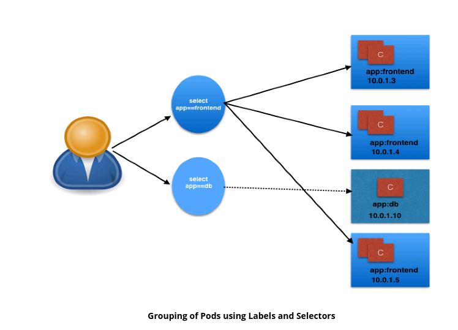


Using selectors (app==frontend and app==db), we can group them into two logical groups: one with 3 Pods, and one with just one Pod.

We can assign a name to the logical grouping, referred to as a Service name. In our example, we have created two Services, frontend-svc and db-svc, and they have the app==frontend and the app==db Selectors, respectively.

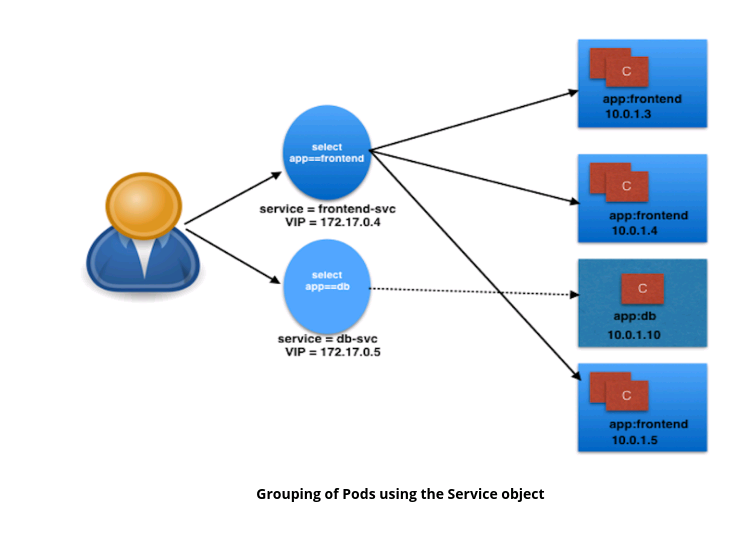

##### 9.2.3 Service Object Example

The following is an example of a Service object:

```yaml
kind: Service
apiVersion: v1
metadata:
  name: frontend-svc
spec:
  selector:
    app: frontend
  ports:
    - protocol: TCP
      port: 80
      targetPort: 5000


```

In this example, we are creating a frontend-svc Service by selecting all the Pods that have the Label app set to the frontend. By default, each Service also gets an IP address, which is routable only inside the cluster. In our case, we have 172.17.0.4 and 172.17.0.5 IP addresses for our frontend-svc and db-svc Services, respectively. The IP address attached to each Service is also known as the ClusterIP for that Service.


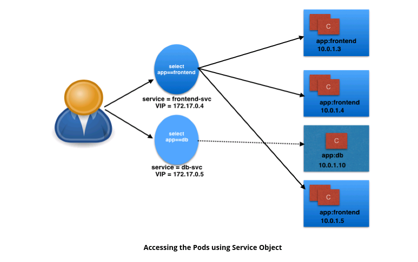

The user/client now connects to a service via the IP address, which forwards the traffic to one of the Pods attached to it. A service does the load balancing while selecting the Pods for forwarding the data/traffic.

While forwarding the traffic from the Service, we can select the target port on the Pod. In our example, for frontend-svc, we will receive requests from the user/client on Port 80. We will then forward these requests to one of the attached Pods on Port 5000. If the target port is not defined explicitly, then traffic will be forwarded to Pods on the port on which the Service receives traffic.

A tuple of Pods, IP addresses, along with the targetPort is referred to as a Service endpoint. In our case, frontend-svc has 3 endpoints: 10.0.1.3:5000, 10.0.1.4:5000, and 10.0.1.5:5000.

##### 9.2.4  kube-proxy

All of the worker nodes run a daemon called kube-proxy, which watches the API server on the master node for the addition and removal of Services and endpoints. For each new Service, on each node, kube-proxy configures the iptables rules to capture the traffic for its ClusterIP and forwards it to one of the endpoints. When the service is removed, kube-proxy removes the iptables rules on all nodes as well.

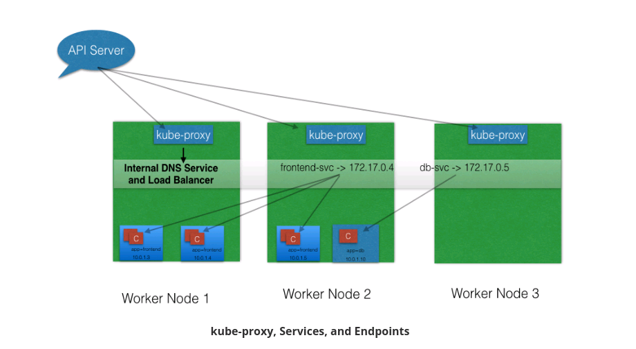

##### 9.2.5 Service Discovery

As Services are the primary mode of communication in Kubernetes, we need a way to discover them at runtime. Kubernetes supports two methods of discovering a Service:

- Environment Variables
   As soon as the Pod starts on any worker node, the kubelet daemon running on that node adds a set of environment variables in the Pod for all active Services. For example, if we have an active Service called redis-master, which exposes port 6379, and its ClusterIP is 172.17.0.6, then, on a newly created Pod, we can see the following environment variables:
    REDIS_MASTER_SERVICE_HOST=172.17.0.6
    REDIS_MASTER_SERVICE_PORT=6379
    REDIS_MASTER_PORT=tcp://172.17.0.6:6379
    REDIS_MASTER_PORT_6379_TCP=tcp://172.17.0.6:6379
    REDIS_MASTER_PORT_6379_TCP_PROTO=tcp
    REDIS_MASTER_PORT_6379_TCP_PORT=6379
    REDIS_MASTER_PORT_6379_TCP_ADDR=172.17.0.6
   With this solution, we need to be careful while ordering our Services, as the Pods will not have the environment variables set for Services which are created after the Pods are created.

- DNS
  Kubernetes has an add-on for DNS, which creates a DNS record for each Service and its format is like my-svc.my-namespace.svc.cluster.local. Services within the same Namespace can reach to other Services with just their name. For example, if we add a Service redis-master in the my-ns Namespace, then all the Pods in the same Namespace can reach to the redis Service just by using its name, redis-master. Pods from other Namespaces can reach the Service by adding the respective Namespace as a suffix, like redis-master.my-ns. 

  This is the most common and highly recommended solution. For example, in the previous section's image, we have seen that an internal DNS is configured, which maps our Services frontend-svc and db-svc to 172.17.0.4 and 172.17.0.5, respectively. 

##### 9.2.6 ServiceType

While defining a Service, we can also choose its access scope. We can decide whether the Service:

- Is only accessible within the cluster
- Is accessible from within the cluster and the external world
- Maps to an external entity which resides outside the cluster.

Access scope is decided by ServiceType, which can be mentioned when creating the Service.


##### 9.2.7 ServiceType: ClusterIP and NodePort

ClusterIP is the default ServiceType. A Service gets its Virtual IP address using the ClusterIP. That IP address is used for communicating with the Service and is accessible only within the cluster. 

With the NodePort ServiceType, in addition to creating a ClusterIP, a port from the range 30000-32767 is mapped to the respective Service, from all the worker nodes. For example, if the mapped NodePort is 32233 for the service frontend-svc, then, if we connect to any worker node on port 32233, the node would redirect all the traffic to the assigned ClusterIP - 172.17.0.4.

By default, while exposing a NodePort, a random port is automatically selected by the Kubernetes Master from the port range 30000-32767. If we don't want to assign a dynamic port value for NodePort, then, while creating the service, we can also give a port number from the earlier specific range. 

 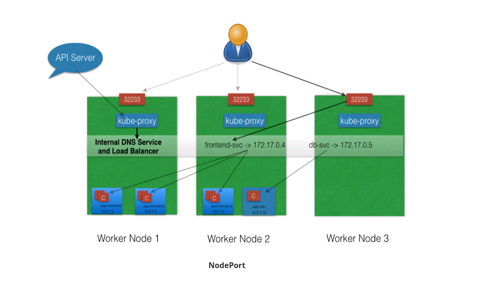

The NodePort ServiceType is useful when we want to make our Services accessible from the external world. The end-user connects to the worker nodes on the specified port, which forwards the traffic to the applications running inside the cluster. To access the application from the external world, administrators can configure a reverse proxy outside the Kubernetes cluster and map the specific endpoint to the respective port on the worker nodes. 


##### 9.2.8 ServiceType: LoadBalancer

With the LoadBalancer ServiceType:

- NodePort and ClusterIP Services are automatically created, and the external load balancer will route to them
- The Services are exposed at a static port on each worker node
- The Service is exposed externally using the underlying cloud provider's load balancer feature.

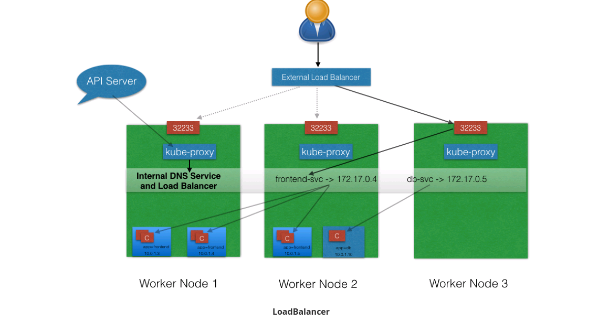

The LoadBalancer ServiceType will only work if the underlying infrastructure supports the automatic creation of Load Balancers and have the respective support in Kubernetes, as is the case with the Google Cloud Platform and AWS. 


##### 9.2.9 ServiceType: ExternalIP

A Service can be mapped to an ExternalIP address if it can route to one or more of the worker nodes. Traffic that is ingressed into the cluster with the ExternalIP (as destination IP) on the Service port, gets routed to one of the the Service endpoints.

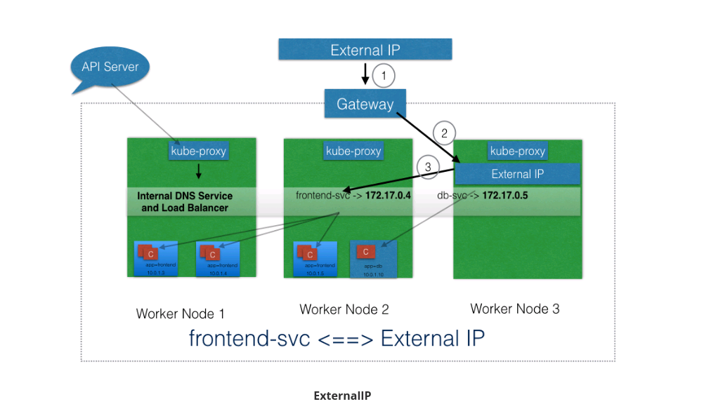

##### 9.2.10 ServiceType: ExternalName

ExternalName is a special ServiceType, that has no Selectors and does not define any endpoints. When accessed within the cluster, it returns a CNAME record of an externally configured Service.

The primary use case of this ServiceType is to make externally configured Services like my-database.example.com available inside the cluster, using just the name, like my-database, to other Services inside the same Namespace.

### 10. Deploying a Stand-Alone Application  

#### 10.1 Introduction and Learning Objectives  

##### 10.1.1 Introduction

In this chapter, we will learn how to deploy an application using Graphical User Interface (GUI) or Command Line Interface (CLI). We will also expose an application with NodePort, and access it from the external world.


##### 10.1.2 Learning Objectives

By the end of this chapter, you should be able to:

- Deploy an application from the dashboard.
- Deploy an application from a YAML file using kubectl.
- Expose a service using NodePort.
- Access the application from the external world.

### 11. Kubernetes Volume Management

#### 11.1  Introduction and Learning Objectives  

##### 11.1.1 Introduction

To back a Pod with a persistent storage, Kubernetes uses Volumes. In this chapter, we will learn about Volumes and their types. We will also talk about PersistentVolume and PersistentVolumeClaim objects, which help us attach storage Volumes to Pods. 

##### 11.1.2  Learning Objectives

By the end of this chapter, you should be able to:

- Explain the need for persistent data management.
- Discuss Kubernetes Volume and its types.
- Discuss PersistentVolumes and PersistentVolumeClaims.

#### 11.2 Kubernetes Volume Management  

##### 11.2.1 Volumes

As we know, containers, which create the Pods, are ephemeral in nature. All data stored inside a container is deleted if the container crashes. However, the kubelet will restart it with a clean state, which means that it will not have any of the old data.

To overcome this problem, Kubernetes uses Volumes. A Volume is essentially a directory backed by a storage medium. The storage medium and its content are determined by the Volume Type.

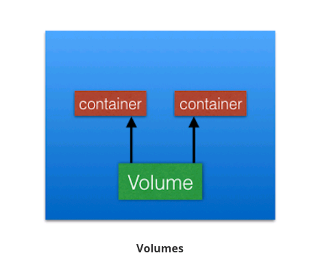

In Kubernetes, a Volume is attached to a Pod and shared among the containers of that Pod. The Volume has the same life span as the Pod, and it outlives the containers of the Pod - this allows data to be preserved across container restarts.

##### 11.2.2 Volume Types

A directory which is mounted inside a Pod is backed by the underlying Volume Type. A Volume Type decides the properties of the directory, like size, content, etc. Some examples of Volume Types are:

- emptyDir
  An empty Volume is created for the Pod as soon as it is scheduled on the worker node. The Volume's life is tightly coupled with the Pod. If the Pod dies, the content of emptyDir is deleted forever.  
- hostPath
  With the hostPath Volume Type, we can share a directory from the host to the Pod. If the Pod dies, the content of the Volume is still available on the host.
- gcePersistentDisk
  With the gcePersistentDisk Volume Type, we can mount a Google Compute Engine (GCE) persistent disk into a Pod.
- awsElasticBlockStore
  With the awsElasticBlockStore Volume Type, we can mount an AWS EBS Volume into a Pod. 
- nfs
  With nfs, we can mount an NFS share into a Pod.
- iscsi
  With iscsi, we can mount an iSCSI share into a Pod.
- secret
  With the secret Volume Type, we can pass sensitive information, such as passwords, to Pods. We will take a look at an example in a later chapter.
- persistentVolumeClaim
  We can attach a PersistentVolume to a Pod using a persistentVolumeClaim. We will cover this in our next section. 

You can learn more details about Volume Types in the Kubernetes documentation.

##### 11.2.3 PersistentVolumes

In a typical IT environment, storage is managed by the storage/system administrators. The end user will just get instructions to use the storage, but does not have to worry about the underlying storage management.

In the containerized world, we would like to follow similar rules, but it becomes challenging, given the many Volume Types we have seen earlier. Kubernetes resolves this problem with the PersistentVolume (PV) subsystem, which provides APIs for users and administrators to manage and consume storage. To manage the Volume, it uses the PersistentVolume API resource type, and to consume it, it uses the PersistentVolumeClaim API resource type.

A Persistent Volume is a network-attached storage in the cluster, which is provisioned by the administrator.

PersistentVolumes can be dynamically provisioned based on the StorageClass resource. A StorageClass contains pre-defined provisioners and parameters to create a PersistentVolume. Using PersistentVolumeClaims, a user sends the request for dynamic PV creation, which gets wired to the StorageClass resource.

Some of the Volume Types that support managing storage using PersistentVolumes are:

- GCEPersistentDisk
- AWSElasticBlockStore
- AzureFile
- NFS
- iSCSI.
  For a complete list, as well as more details, you can check out the Kubernetes documentation.

##### 11.2.4  PersistentVolumeClaims

A PersistentVolumeClaim (PVC) is a request for storage by a user. Users request for PersistentVolume resources based on size, access modes, etc. Once a suitable PersistentVolume is found, it is bound to a PersistentVolumeClaim.

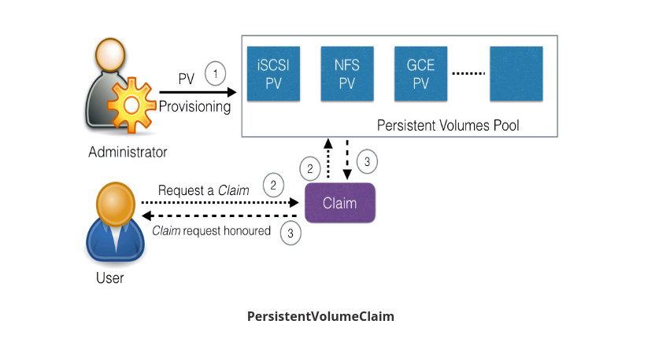

After a successful bound, the PersistentVolumeClaim resource can be used in a Pod.

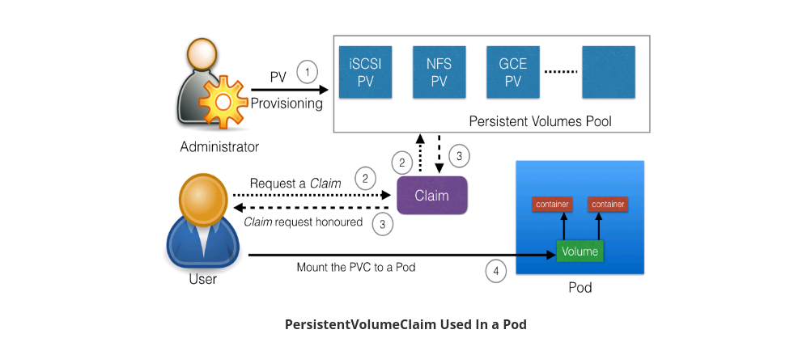

Once a user finishes its work, the attached PersistentVolumes can be released. The underlying PersistentVolumes can then be reclaimed and recycled for future usage. 

##### 11.2.5 Container Storage Interface (CSI)

At the time this course was created, container orchestrators like Kubernetes, Mesos, Docker or Cloud Foundry had their own way of managing external storage using Volumes.

For storage vendors, it is difficult to manage different Volume plugins for different orchestrators. Storage vendors and community members from different orchestrators are working together to standardize the Volume interface; a volume plugin built using a standardized CSI would work on different container orchestrators. You can find CSI specifications here.

Kubernetes 1.9 added alpha support for CSI, which makes installing new CSI-compliant Volume plugins very easy. With CSI, third-party storage providers can develop solutions without the need to add them into the core Kubernetes codebase.


### 12. Deploying a Multi-Tier Application  

#### 12.1 Introduction and Learning Objectives  

##### 12.1.1 Introduction

In a typical application, we have different tiers:

- Backend
- Frontend
- Caching, etc.
  In this chapter, we will learn to deploy a multi-tier application with Kubernetes and then scale it. 

##### 12.1.2 Learning Objectives

By the end of this chapter, you should be able to:

- Analyze a sample multi-tier application.
- Deploy a multi-tier application.
- Scale an application.

#### 12.2 RSVP Application

We will be using a sample RSVP application. Using this application, users can register for an event by providing their username and email ID. Once a user registers, his/her name and email appears in a table. The application consists of a backend database and a frontend. For the backend, we will be using a MongoDB database, and for the frontend, we have a Python Flask-based application.

### 13. ConfigMaps and Secrets

#### 13.1 Introduction and Learning Objectives  

##### 13.1.1 Introduction

While deploying an application, we may need to pass such runtime parameters like configuration details, passwords, etc. For example, let's assume we need to deploy ten different applications for our customers, and, for each customer, we just need to change the name of the company in the UI. Then, instead of creating ten different Docker images for each customer, we may just use the template image and pass the customers' names as a runtime parameter. In such cases, we can use the ConfigMap API resource. Similarly, when we want to pass sensitive information, we can use the Secret API resource. In this chapter, we will explore ConfigMaps and Secrets.

##### 13.1.2 Learning Objectives

By the end of this chapter, you should be able to:

- Discuss configuration management for applications in Kubernetes using ConfigMaps.
- Share sensitive data (such as passwords) using Secrets.

#### 13.2  ConfigMaps and Secrets  

##### 13.2.1 ConfigMaps

ConfigMaps allow us to decouple the configuration details from the container image. Using ConfigMaps, we can pass configuration details as key-value pairs, which can be later consumed by Pods, or any other system components, such as controllers. We can create ConfigMaps in two ways:

- From literal values
- From files.

##### 13.2.2 Create a ConfigMap from Literal Values and Get Its Details

A ConfigMap can be created with the kubectl create command, and we can get the values using the kubectl get command.

Create the ConfigMap

```
$ kubectl create configmap my-config --from-literal=key1=value1 --from-literal=key2=value2
configmap "my-config" created 

```

Get the ConfigMap Details for my-config

```yaml
$ kubectl get configmaps my-config -o yaml
apiVersion: v1
data:
  key1: value1
  key2: value2
kind: ConfigMap
metadata:
  creationTimestamp: 2017-05-31T07:21:55Z
  name: my-config
  namespace: default
  resourceVersion: "241345"
  selfLink: /api/v1/namespaces/default/configmaps/my-config
  uid: d35f0a3d-45d1-11e7-9e62-080027a46057
```

With the -o yaml option, we are requesting the kubectl command to spit the output in the YAML format. As we can see, the object has the ConfigMap kind, and it has the key-value pairs inside the data field. The name of ConfigMap and other details are part of the metadata field.


##### 13.2.3 Create a ConfigMap from a Configuration File

First, we need to create a configuration file. We can have a configuration file with the content like:

```yaml
apiVersion: v1
kind: ConfigMap
metadata:
  name: customer1
data:
  TEXT1: Customer1_Company
  TEXT2: Welcomes You
  COMPANY: Customer1 Company Technology Pct. Ltd.
```

in which we mentioned the kind, metadata, and data fields, which are targeted to connect with the v1 endpoint of the API server.

If we name the file with the configuration above as customer1-configmap.yaml, we can then create the ConfigMap with the following command:

```yaml
$ kubectl create -f customer1-configmap.yaml
configmap "customer1" created
```

##### 13.2.4 Use ConfigMap Inside Pods

**As an Environment Variable**
We can get the values of the given key as environment variables inside a Pod. In the following example, while creating the Deployment, we are assigning values for environment variables from the customer1 ConfigMap:

```yaml
....
 containers:
      - name: rsvp-app
        image: teamcloudyuga/rsvpapp
        env:
        - name: MONGODB_HOST
          value: mongodb
        - name: TEXT1
          valueFrom:
            configMapKeyRef:
              name: customer1
              key: TEXT1
        - name: TEXT2
          valueFrom:
            configMapKeyRef:
              name: customer1
              key: TEXT2
        - name: COMPANY
          valueFrom:
            configMapKeyRef:
              name: customer1
              key: COMPANY

....
```

With the above, we will get the TEXT1 environment variable set to Customer1_Company, TEXT2 environment variable set to Welcomes You, and so on.

As a Volume
We can mount a ConfigMap as a Volume inside a Pod. For each key, we will see a file in the mount path and the content of that file becomes the respective key's value. For more details, please study the Kubernetes documentation.


##### 13.2.5 Secrets

Let's assume that we have a Wordpress blog application, in which our wordpress frontend connects to the MySQL database backend using a password. While creating the Deployment for wordpress, we can put down the MySQL password in the Deployment's YAML file, but the password would not be protected. The password would be available to anyone who has access to the configuration file.

In situations such as the one we just mentioned, the Secret object can help. With Secrets, we can share sensitive information like passwords, tokens, or keys in the form of key-value pairs, similar to ConfigMaps; thus, we can control how the information in a Secret is used, reducing the risk for accidental exposures. In Deployments or other system components, the Secret object is referenced, without exposing its content.

**It is important to keep in mind that the Secret data is stored as plain text inside etcd. Administrators must limit the access to the API server and etcd.**

##### 13.2.6 Create the Secret with the 'kubectl create secret' Command

To create a Secret, we can use the kubectl create secret command:

```
$ kubectl create secret generic my-password --from-literal=password=mysqlpassword
```

The above command would create a secret called my-password, which has the value of the password key set to mysqlpassword.

##### 13.2.7 'get' and 'describe' the Secret

Analyzing the get and describe examples below, we can see that they do not reveal the content of the Secret. The type is listed as **Opaque**.

```yaml
$ kubectl get secret my-password
NAME          TYPE     DATA   AGE 
my-password   Opaque   1      8m

$ kubectl describe secret my-password
Name:          my-password
Namespace:     default
Labels:        <none>
Annotations:   <none>

Type  Opaque

Data
====
password.txt:  13 bytes
```


##### 13.2.8 Create a Secret Manually

We can also create a Secret manually, using the YAML configuration file. With Secrets, each object data must be encoded using base64. If we want to have a configuration file for our Secret, we must first get the base64 encoding for our password:

```bash
$ echo mysqlpassword | base64

bXlzcWxwYXNzd29yZAo=
```

and then use it in the configuration file:

```yaml
apiVersion: v1
kind: Secret
metadata:
  name: my-password
type: Opaque
data:
  password: bXlzcWxwYXNzd29yZAo=
```

Please note that base64 encoding does not do any encryption, and anyone can easily decode it:

```bash
$ echo "bXlzcWxwYXNzd29yZAo=" | base64 --decode
```

Therefore, make sure you do not commit a Secret's configuration file in the source code.


##### 13.2.9 Use Secrets Inside Pods

We can get Secrets to be used by containers in a Pod by mounting them as data volumes, or by exposing them as environment variables.

**Using Secrets as Environment Variables**
As shown in the following example, we can reference a Secret and assign the value of its key as an environment variable **(WORDPRESS_DB_PASSWORD)**:

```yaml
.....
         spec:
      containers:
      - image: wordpress:4.7.3-apache
        name: wordpress
        env:
        - name: WORDPRESS_DB_HOST
          value: wordpress-mysql
        - name: WORDPRESS_DB_PASSWORD
          valueFrom:
            secretKeyRef:
              name: my-password
              key: password
.....
```

**Using Secrets as Files from a Pod**

We can also mount a Secret as a Volume inside a Pod. A file would be created for each key mentioned in the Secret, whose content would be the respective value. For more details, you can study the Kubernetes documentation.


### 14. Ingress  

#### 14.1 Introduction and Learning Objectives  

##### 14.1.1 Introduction

In Chapter 9. Services, we saw how we can access our deployed containerized application from the external world. Among the ServiceTypes mentioned in that chapter, NodePort and LoadBalancer are the most often used. For the LoadBalancer ServiceType, we need to have the support from the underlying infrastructure. Even after having the support, we may not want to use it for every Service, as LoadBalancer resources are limited and they can increase costs significantly. Managing the NodePort ServiceType can also be tricky at times, as we need to keep updating our proxy settings and keep track of the assigned ports. In this chapter, we will explore the Ingress, which is another method we can use to access our applications from the external world.

##### 14.1.2 Learning Objectives

By the end of this chapter, you should be able to:

- Explain what Ingress and Ingress Controllers are.
- Learn when to use Ingress.
- Access an application from the external world using Ingress.

#### 14.2 Ingress

##### 14.2.1 Ingress I

With Services, routing rules are attached to a given Service. They exist for as long as the Service exists. If we can somehow decouple the routing rules from the application, we can then update our application without worrying about its external access. This can be done using the Ingress resource. 

According to kubernetes.io,

*"An Ingress is a collection of rules that allow inbound connections to reach the cluster Services."*

To allow the inbound connection to reach the cluster Services, Ingress configures a Layer 7 HTTP load balancer for Services and provides the following:

- TLS (Transport Layer Security)
- Name-based virtual hosting 
- Path-based routing
- Custom rules.

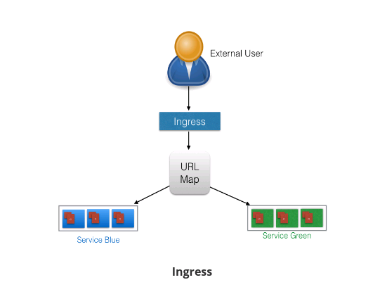

##### 14.2.2 Ingress II

With Ingress, users don't connect directly to a Service. Users reach the Ingress endpoint, and, from there, the request is forwarded to the respective Service. You can see an example of a sample Ingress definition below:

```yaml
apiVersion: extensions/v1beta1
kind: Ingress
metadata:
  name: web-ingress
  namespace: default
spec:
  rules:
  - host: blue.example.com
    http:
      paths:
      - backend:
          serviceName: webserver-blue-svc
          servicePort: 80
  - host: green.example.com
    http:
      paths:
      - backend:
          serviceName: webserver-green-svc
          servicePort: 80
```

According to the example we provided above, users requests to both blue.example.com and green.example.com would go to the same Ingress endpoint, and, from there, they would be forwarded to webserver-blue-svc, and webserver-green-svc, respectively. Here, we have seen an example of a Name-Based Virtual Hosting Ingress rule. 

We can also have Fan Out Ingress rules, in which we send requests like example.com/blue and example.com/green, which would be forwarded to webserver-blue-svc and webserver-green-svc, respectively.

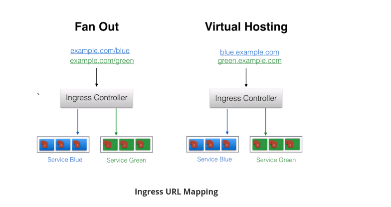

The Ingress resource does not do any request forwarding by itself. All of the magic is done using the Ingress Controller, which we will discuss next.

##### 14.2.3  Ingress Controller

An Ingress Controller is an application which watches the Master Node's API server for changes in the Ingress resources and updates the Layer 7 Load Balancer accordingly. Kubernetes has different Ingress Controllers, and, if needed, we can also build our own. GCE L7 Load Balancer and Nginx Ingress Controller are examples of Ingress Controllers. 

**Start the Ingress Controller with Minikube**

Minikube v0.14.0 and above ships the Nginx Ingress Controller setup as an add-on. It can be easily enabled by running the following command:

```bash
$ minikube addons enable ingress
```

##### 14.2.4 Deploy an Ingress Resource

Once the Ingress Controller is deployed, we can create an Ingress resource using the kubectl create command. For example, if we create a webserver-ingress.yaml file with the content that we saw on the Ingress II page, then, we will use the following command to create an Ingress resource:

```bash
$ kubectl create -f webserver-ingress.yaml
```


##### 14.2.5  Access Services Using Ingress

With the Ingress resource we just created, we should now be able to access the webserver-blue-svc or webserver-green-svc services using the blue.example.com and green.example.com URLs. As our current setup is on Minikube, we will need to update the host configuration file (/etc/hosts on Mac and Linux) on our workstation to the Minikube IP for those URLs:

```bash
$ cat /etc/hosts
127.0.0.1        localhost
::1              localhost
192.168.99.100   blue.example.com green.example.com 
```

Once this is done, we can open blue.example.com and green.example.com on the browser and access the application.


###  15. Advanced Topics - Overview

#### 15.1 Introduction and Learning Objectives

##### 15.1.1 **Introduction**

So far, in this course, we have spend most of our time understanding the basic Kubernetes concepts and simple workflows to build a solid foundation. To support enterprise class production workloads, Kubernetes can do auto-scaling, rollbacks, quota management, RBAC, etc. In this chapter, we will get a high-level overview about such advanced topics, but diving into details would be out of scope for this course. 

##### 15.1.2 Learning Objectives

By the end of this chapter, you should be able to:

- Discuss advanced Kubernetes concepts: DaemonSets, StatefulSets, Helm, etc.

#### 15.2  Advanced Topics - Overview

##### 15.2.1 Annotations

With Annotations, we can attach arbitrary non-identifying metadata to any objects, in a key-value format:

```json
"annotations": {
  "key1" : "value1",
  "key2" : "value2"
}

```

In contrast to Labels, annotations are not used to identify and select objects. Annotations can be used to:

- Store build/release IDs, PR numbers, git branch, etc.
- Phone/pager numbers of people responsible, or directory entries specifying where such information can be found
- Pointers to logging, monitoring, analytics, audit repositories, debugging tools, etc.
- Etc.

 For example, while creating a Deployment, we can add a description like the one below:

```yaml
apiVersion: extensions/v1beta1
kind: Deployment
metadata:
  name: webserver
  annotations:
    description: Deployment based PoC dates 2nd June'2017
....
....	
```

We can look at annotations while describing an object:

```bash
$ kubectl describe deployment webserver
Name:                webserver
Namespace:           default
CreationTimestamp:   Sat, 03 Jun 2017 05:10:38 +0530
Labels:              app=webserver
Annotations:         deployment.kubernetes.io/revision=1
                     description=Deployment based PoC dates 2nd June'2017
...
...
```

##### 15.2.2 Deployment Features

Earlier, we have seen how we can use the Deployment object to deploy an application. This is just a basic functionality. We can do more interesting things, like recording a Deployment - if something goes wrong, we can revert to the working state.

The graphic below depicts a situation in which our update fails:

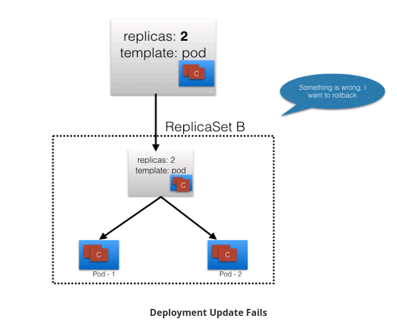

If we have recorded our Deployment before doing the update, we can revert back to a known working state.

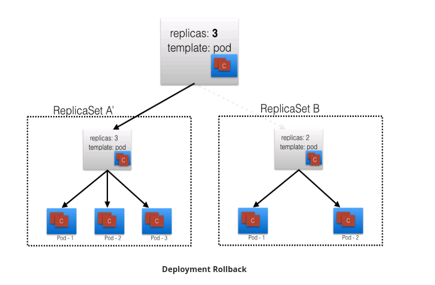

In addition, the Deployment object also provides the following features:

- Autoscaling
- Proportional scaling
- Pausing and resuming.

##### 15.2.3 Jobs

A Job creates one or more Pods to perform a given task. The Job object takes the responsibility of Pod failures. It makes sure that the given task is completed successfully. Once the task is over, all the Pods are terminated automatically.

Starting with the Kubernetes 1.4 release, we can also perform Jobs at specified times/dates, such as cron jobs. 

##### 15.2.4 Quota Management

When there are many users sharing a given Kubernetes cluster, there is always a concern for fair usage. A user should not take undue advantage. To address this concern, administrators can use the ResourceQuota object, which provides constraints that limit aggregate resource consumption per Namespace.

We can have the following types of quotas per Namespace:

- **Compute Resource Quota**
  We can limit the total sum of compute resources (CPU, memory, etc.) that can be requested in a given Namespace.
- **Storage Resource Quota**
  We can limit the total sum of storage resources (PersistentVolumeClaims, requests.storage, etc.) that can be requested.
- **Object Count Quota**
  We can restrict the number of objects of a given type (pods, ConfigMaps, PersistentVolumeClaims, ReplicationControllers, Services, Secrets, etc.).


##### 15.2.5 DaemonSets


In some cases, like collecting monitoring data from all nodes, or running a storage daemon on all nodes, etc., we need a specific type of Pod running on all nodes at all times. A DaemonSet is the object that allows us to do just that. 

Whenever a node is added to the cluster, a Pod from a given DaemonSet is created on it. When the node dies, the respective Pods are garbage collected. If a DaemonSet is deleted, all Pods it created are deleted as well.


##### 15.2.6 StatefulSets

The StatefulSet controller is used for applications which require a unique identity, such as name, network identifications, strict ordering, etc. For example, MySQL cluster, etcd cluster.

The StatefulSet controller provides identity and guaranteed ordering of deployment and scaling to Pods.

The StatefulSet controller provides identity and guaranteed ordering of deployment and scaling to Pods.

##### 15.2.7 Kubernetes Federation

With the Kubernetes Cluster Federation we can manage multiple Kubernetes clusters from a single control plane. We can sync resources across the clusters and have cross-cluster discovery. This allows us to do Deployments across regions and access them using a global DNS record.

The Federation is very useful when we want to build a hybrid solution, in which we can have one cluster running inside our private datacenter and another one on the public cloud. We can also assign weights for each cluster in the Federation, to distribute the load as per our choice.

##### 15.2.8 Custom Resources

In Kubernetes, a resource is an API endpoint which stores a collection of API objects. For example, a Pod resource contains all the Pod objects.

Although in most cases existing Kubernetes resources are sufficient to fulfill our requirements, we can also create new resources using custom resources. With custom resources, we don't have to modify the Kubernetes source.

Custom resources are dynamic in nature, and they can appear and disappear in an already running cluster at any time.

To make a resource declarative, we must create and install a custom controller, which can interpret the resource structure and perform the required actions. Custom controllers can be deployed and managed in an already running cluster.

There are two ways to add custom resources:

- Custom Resource Definitions (CRDs)
  This is the easiest way to add custom resources and it does not require any programming knowledge. However, building the custom controller would require some programming.
- API Aggregation
  For more fine-grained control, we can write API Aggregators. They are subordinate API servers which sit behind the primary API server and act as proxy.

##### 15.2.9 Helm

To deploy an application, we use different Kubernetes manifests, such as Deployments, Services, Volume Claims, Ingress, etc. Sometimes, it can be tiresome to deploy them one by one. We can bundle all those manifests after templatizing them into a well-defined format, along with other metadata. Such a bundle is referred to as Chart. These Charts can then be served via repositories, such as those that we have for rpm and deb packages. 

Helm is a package manager (analogous to yum and apt) for Kubernetes, which can install/update/delete those Charts in the Kubernetes cluster.

Helm has two components:

- A client called helm, which runs on your user's workstation
- A server called tiller, which runs inside your Kubernetes cluster. 

The client helm connects to the server tiller to manage Charts. Charts submitted for Kubernetes are available here.

##### 15.2.10 Monitoring and Logging

In Kubernetes, we have to collect resource usage data by Pods, Services, nodes, etc., to understand the overall resource consumption and to make decisions for scaling a given application. Two popular Kubernetes monitoring solutions are Heapster and Prometheus.

- Heapster 
  Heapster is a cluster-wide aggregator of monitoring and event data, which is natively supported on Kubernetes. 
- Prometheus
  Prometheus, now part of CNCF (Cloud Native Computing Foundation), can also be used to scrape the resource usage from different Kubernetes components and objects. Using its client libraries, we can also instrument the code of our application.

Another important aspect for troubleshooting and debugging is Logging, in which we collect the logs from different components of a given system. In Kubernetes, we can collect logs from different cluster components, objects, nodes, etc. The most common way to collect the logs is using Elasticsearch, which uses fluentd with custom configuration as an agent on the nodes. fluentd is an open source data collector, which is also part of CNCF.


### 16.  Kubernetes Community

#### 16.1 Introduction and Learning Objectives

##### 16.1.1 Introduction

Just as with any other open source project, the community plays a vital role in Kubernetes. The community decides the roadmap of the projects and works towards it. The community gets engaged in different online and offline forums, like Meetups, Slack, Weekly meetings, etc. In this chapter, we will explore the Kubernetes community and see how you can become a part of it, too. 

##### 16.1.2 Learning Objectives

By the end of this chapter, you should be able to:

- Understand the importance of Kubernetes community.
- Learn about the different channels to interact with the Kubernetes community.
- List major CNCF events.

#### 16.2 Kubernetes Community  

##### 16.2.1 Kubernetes Community

With more than 33 thousand GitHub stars, Kubernetes is one of the most popular open source projects. The community members not only help with the source code, but they also help with sharing the knowledge. The community engages in both online and offline activities.

Currently, there is a project called K8sPort, which recognizes and rewards community members for their contributions to Kubernetes. This contribution can be in the form of code, attending and speaking at meetups, answering questions on Stack Overflow, etc.

Next, we will review some of the mediums used by the Kubernetes community.


##### 16.2.2 Weekly Meetings and Meetup Groups

- Weekly Meetings
  A weekly community meeting happens using video conference tools. You can get a calendar invite from here.

- Meetup Groups
  There are many meetup groups around the world, where local community members meet at regular intervals to discuss Kubernetes and its ecosystem.

There are some online meetup groups as well, where community members can meet virtually.

##### 16.2.3 Slack Channels and Mailing Lists

- Slack Channels
  Community members are very active on the Kubernetes Slack. There are different channels based on topics, and anyone can join and participate in the discussions. You can discuss with the Kubernetes team on the #kubernetes-users channel. 

- Mailing Lists
  There are Kubernetes users and developers mailing lists, which can be joined by anybody interested.

##### 16.2.4 SIGs and Stack Overflow

- Special Interest Groups
  Special Interest Groups (SIGs) focus on specific parts of the Kubernetes project, like scheduling, authorization, networking, documentation, etc. Each group may have a different workflow, based on its specific requirements. A list with all the current SIGs can be found [here](https://github.com/kubernetes/community/blob/master/sig-list.md).

  Depending on the need, a new SIG can be created.

- Stack Overflow
  Besides Slack and mailing lists, community members can get support from Stack Overflow, as well. Stack Overflow is an online environment where you can post questions that you cannot find an answer for. The Kubernetes team also monitors the posts tagged Kubernetes.