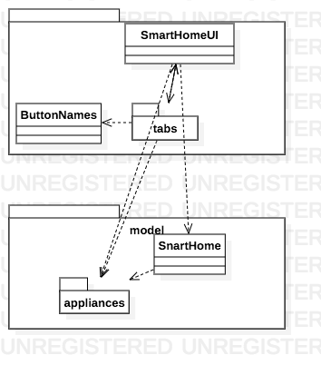
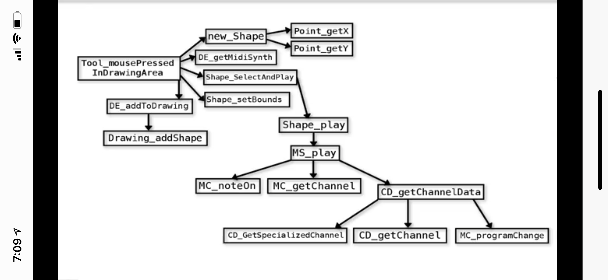
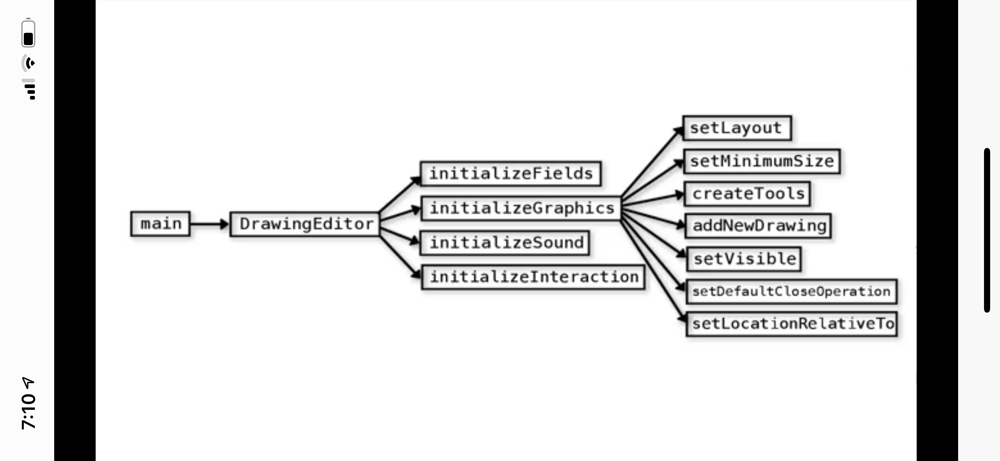

## Software Construction: Data Abstraction

### 1. Introduction to Software Construction

#### 1.1 Module Overview

#### **Things you'll learn (without knowing any Java!):**

- How to explore the behaviour and structure of a system
- How to draw a diagram of the relationships between packages and between classes to help your understanding of a totally new system
- Make small changes to a system that you know nothing about, to see if it breaks or changes (this is the beginning of code exploration)

#### 1.2  Welcome

#### 1.3  Walking up to a Codebase: First Look

- To launch an application (execute code) in an IntelliJ project, look for a class that has a play symbol next to it 
- In a Java project, folders are called *packages.* Packages contain classes (each in their own file)  
- To begin to understand a codebase, run the code, and try to relate behaviour in the running code to the names of the Packages and Classes

how to read code :

- look at the files & folders
- run the program
- relate the app to the code 
- inter-package relationships
- inter file relationships

#### 1.4 Walking Up to a Codebase: Package Relationships  

- To explore the architectural structure of your project, look inside the classes and look at the import statements at the top of the class
- Import statements indicate inter-package relationships
- Concentrate on import statements within your project
  A good starting point is the class that is runnable (the one with the play icon)  
- Draw an informal picture to keep track of your exploration, and try to see the big picture as opposed to getting bogged down in details.

### 2a: Control and Data Flow: Structures

#### 2a.1 Module Overview

 Things you'll learn:

- **Java concepts**: classes, methods, how data flows in programs, how parameters are passed, how values are returned from methods, and how objects are created.
- **Control-flow models**: how to depict and communicate the internal execution of a method using flowcharts and how to depict and communicate the execution of a program using call graphs.  We will show you how to use a debugger to help produce these control-flow models from given Java source code

#### 2a.2 Introduction

#### 2a.3 Call Graphs

- Method calls look like this: **methodName(...);** *or* **objectName.methodName(...);**
- To jump to a method definition, hit **command-B** on a Mac, or **control-B** on Windows
- To build a call graph, look at all the method calls in a method definition and draw a line on the graph from the method to each method it calls.
- execution by pressing the play button starts at main
- execution by interacting with the mouse starts at the corresponding mouse handler methods (usually named well enough to tell which one)

