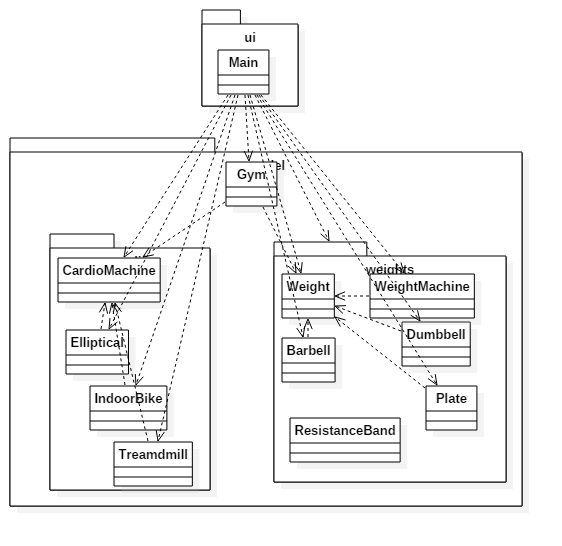
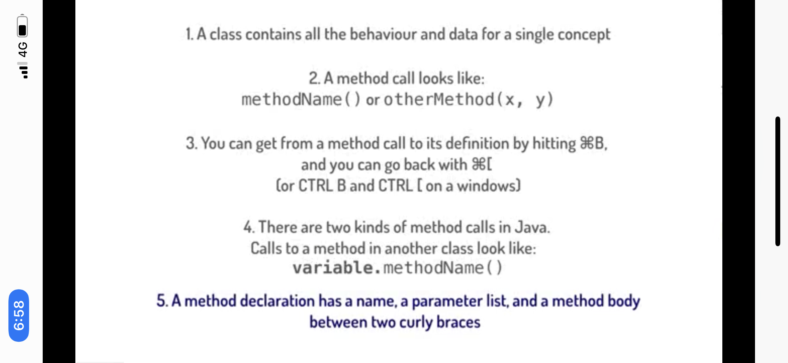
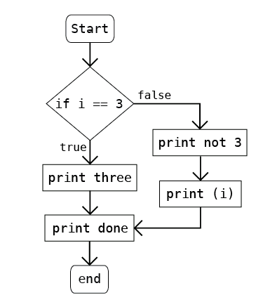
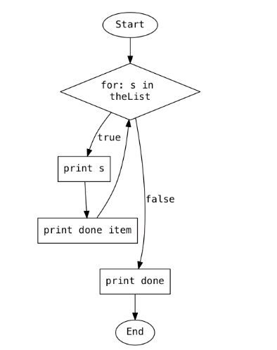
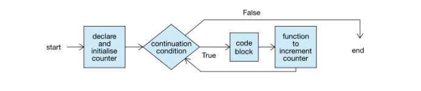
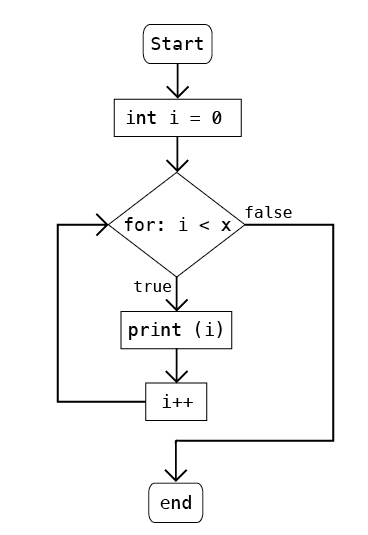

## Software Construction: Data Abstraction

[TOC]

### 0.Debugging

#### 0.1 Debugging, Part 1 (setting values and output)

https://github.com/SharksZhang/control-and-data-flow-lecture-starters

**Technical points in this video:**

- **Hypothesis driven debugging**: making careful educated guesses, with plans for how to validate or invalidate them.
- Breakpoints let you stop execution of your code at a specific point. Set a breakpoint by clicking on the left next to the line of code (in the grey area).  Then step over or step into methods, watching the values of variables in scope as you go.
- Choose the "debug" icon instead of the "run" icon to execute your code in debugging mode.
- If it looks like a value isn't being set there are a few common possibilities: step through to ensure it's being displayed or returned correctly, and step through to where the value should be set, and make sure it's being set properly.
- If you are getting output you weren't expecting, try placing a breakpoint at the code responsible for the output -- then you will be able to check the state of all the variables to see the context of that code -- maybe some of the variables aren't being set properly!

#### 0.2 Debugging, Part 2 (comparisons and variables)

**Technical points in this video:**

- If you notice a value (or field) is showing up as wrong, then there are three typical problems to check: you're not retrieving the value correctly, or you're not setting the field correctly, or you're not setting it at all.
- If you are changing a parameter's value inside a method, and aren't seeing that value reflected once the method has returned, check to make sure you're not just changing a local variable instead of the object referenced by the parameter.  
- If you're looking for an object based on some field, and not finding that object, make sure you are comparing against the field values, rather than accidentally comparing object references. (We will see an even more elegant way to do this in the second course)

#### 0.3 Debugging, Part 3 (ranges and null pointers)

**Technical points from this video:**

- An exception's stack trace message tells us where the execution died (in the method at the top, right below the message)
- An index out of bounds exception means you tried to access off the end of a collection. Remember to check whether you are in range (likely by using the collection.size() method) before accessing a collection.
- A null pointer exception means you tried to execute a method, or access a field in an object that has not been instantiated. Before using an object, it's best to check if it exists! You can use if (theObject!=null) to check.
- Check carefully for typos in conditions (e.g. != instead of ==) and ranges (e.g. <= instead of <). Typos are the most common bugs!
- Remember to keep checking hypotheses even if you have found your bug. There may be more than one thing wrong.

### 1. Introduction to Software Construction

#### 1.0  SmartHome - Intro

#### 1.1 Module Overview

**Things you'll learn (without knowing any Java!):**

- How to explore the behaviour and structure of a system
- How to draw a diagram of the relationships between packages and between classes to help your understanding of a totally new system
- Make small changes to a system that you know nothing about, to see if it breaks or changes (this is the beginning of code exploration)

#### 1.2  Welcome

#### 1.3  Walking up to a Codebase: First Look

- To launch an application (execute code) in an IntelliJ project, look for a class that has a play symbol next to it 
- In a Java project, folders are called *packages.* Packages contain classes (each in their own file)  
- To begin to understand a codebase, run the code, and try to relate behaviour in the running code to the names of the Packages and Classes

how to read code :

- Files and folders
- Run the program
- Relate the app to the code
- Inter-package relationships
- Inter-file relationships

#### 1.4 Walking Up to a Code base: Package Relationships  

- To explore the architectural structure of your project, look inside the classes and look at the import statements at the top of the class
- Import statements indicate inter-package relationships
- Concentrate on import statements within your project
  A good starting point is the class that is runnable (the one with the play icon)  
- Draw an informal picture to keep track of your exploration, and try to see the big picture as opposed to getting bogged down in details.

#### 1.5  Walking Up to a Codebase: Class Relationships  

- If a definition is taken away, every statement that relied on that definition will stop compiling (IntelliJ will put a red line at that statement, or in some way indicate that the code is "broken").

- To see which classes rely on a class, you can take its definition away by commenting out all the code in the file temporarily (be sure to uncomment it afterwards!) and then browsing the packages in the project.

  

  

#### 1.6 Practice Problems

##### 1.6.1 FitLifeGym

https://github.com/UBCx-Software-Construction/intro-to-softconst-practice-projects

  

### 2a. Control and Data Flow: Structures

#### 2a.0 Long-form Coding Problem: FitLifeGym Project

https://github.com/SharksZhang/long-form-problem-starters-1

#### 2a.1  Module Overview

**Things you'll learn:**

- Java concepts: classes, methods, how data flows in programs, how parameters are passed, how values are returned from methods, and how objects are created.
- Control-flow models: how to depict and communicate the internal execution of a method using flowcharts and how to depict and communicate the execution of a program using call graphs.  We will show you how to use a debugger to help produce these control-flow models from given Java source code

#### 2a.2 introduction

#### 2a.3 Call Graphs

In this video you will learn how to make call graphs. Call graphs help us understand the behaviour of a program, still while knowing very little Java. Once again, we'll be looking at the SimpleDrawingPlayer, so make sure you have it open in IntelliJ to follow along.

**Technical points in this video:**

- Method calls look like this: methodName(...); or objectName.methodName(...);

- To build a call graph, look at all the method calls in a method definition and draw a line on the graph from the method to each method it calls.

  

  

  

#### 2a.4  The Anatomy of Methods and Classes

##### 2a.4.1 Classes and Objects

Technical points in this video:

- A class holds operations and data related to one concept.
- A constructor (a special method that lives in the class) instantiates an object, or instance. The object then gets its own copy of everything (non-static) that is defined in the class.
- A constructor is called by writing "new ClassName(...)".

##### 2a.4.2 Variables

- Java has two kinds of types that can be used to declare variables: primitives (int, boolean, ...) and objects
- when primitive values are declared, they get a spot in memory that holds their value. 
  when objects are declared, they get a spot in memory that holds a reference to an instance of their type.
- a = b; assigns whatever value is in b, into a's memory slot. If that value is of a primitive type, it copies the value right in. If b's value is an object reference, that object reference is copied, which means that a and b would refer to the same object.
- ArrayLists hold a sequence of object references to whichever type the ArrayList is declared to hold. ArrayList<Dog> holds a series of references to Dog instances. (Note that adding the same object to the array multiple times puts the same object reference in multiple spots in the array, all pointing to the same instance!)

##### 2a.4.3 Anatomy of a Class

- The Structure panel shows all the methods in a class (command/control-7).
- A class contains: imports, a declaration (its name), and body (its definition).
- A class definition contains constant declarations, field declarations, and method declarations (including constructors).
- A class name summarises its contents to make it clear what concept it is encapsulating. Everything inside the class is centrally related to that class, and ties back to that name. 
- All names must reflect their purpose.  
  - If a name seems not to appropriately capture that purpose, choose Refactor->Rename to change it at the declaration and all use sites (so as not to break your code).  
  - Fields can be declared to be of types defined in the project (Types are Classes and more, as we will see).
  - Constructors are named exactly the same thing as the class, and there can be more than one of them, as long as they have different parameter lists.
  - The keyword Static means that a field or method stays within the class and doesn't get instantiated with the object.

### 2b: Control and Data Flow: Models  

#### 2b.0  Long-form Coding Problem:FitLifeGym

##### 2b.0.1  Assigning Values

Over the next few TODO items, you'll create a gym to add to the chain. Your first TODO is to give your gym a location name, and assign a new member name. If you want, you can also refactor the constant names so they match the values you just assigned.

#### 2b.1 Data Flow

##### 2b.1.1 Data Flow

- Variables get a location in memory to store their value.
- We can assign values to variables - storing their value in that spot in memory.
- y = x;  copies the value from x's memory spot to y's memory spot, regardless of whether this is a primitive value or an object reference.
- Object a = b; copies the reference held in b into a's memory slot. Now they refer point to the same object.

##### 2b.1.2 Passing Parameters

**Technical point of this video:**

- primitives, (like int and boolean) are passed into methods by copying their values, so when the method returns, the original variable (in the calling scope) doesn't change.
- objects (like Dog and ArrayList<Integer>) are passed into methods as copies of references, which means changes to objects persist after the called method ends! 

##### 2b.1.3 Returning Values

- When a method returns a value (whether primitive or object reference), it provides that value back to the call site.
- That value can then be used at the call site, for example to print it, assign its value to variables, or use it in a conditional statement.

##### 2b.1.4 Constructors

- When "new Objectname(...)" is called, the object is created, and then the constructor with the matching parameter list is run.
- The constructor returns an object reference to the newly created object.
- The "this" notation is used when two variables of the same name would exist in a method. We use "this" to indicate the field of the same name as the local variable/parameter.

#### 2b.2 Control Structures and Flowcharts 

##### 2b.2.1 Execution of a Method 

**Technical points in this video:**

- A method has a block of statements (loosely translated to lines of code, though a line of code can contain more than one statement), enclosed within curly braces ({ })
- The statements in the block execute sequentially. To add additional functionality, just add more statements.
- Unless there is a return statement, a method just ends, without providing a value back to the call site.
- Without a return statement, a method cannot be used as a value (passed as a parameter)
- A flowchart draws a picture of the body of a method, statement by statement specifically to show the ordering of statements (so arrows matter, but shapes and perfect correctness of the code inside do not, as long as it is clear which statement is being indicated)

##### 2b.2.2 If and If Else

- if statements consist of the following parts: if (condition) { true code block } where the true code block is only executed if the condition is true, otherwise it is skipped.
- if-else statements look like: if (condition) { true code block } else { false code block } where the true code block is executed if the condition is true, otherwise the false code block is executed.
- Statements do not have their own values, hence cannot be passed as parameters.
- In flowcharts, conditions have two outgoing arrows, True and False. 

##### 2b.2.3 Foreach Loops

**Technical points in this video**

- foreach loops iterate over a collection. 
- foreach loops look like: for (Element e : collection) { code block that can use e }
- Element e is a local variable declaration (local to the loop). "Element" would be substituted with the type of things in your collection, and "e" is any name you choose for the current element. \
- Each time through the loop, the next element is pulled from the collection, and stored in local variable e. That variable can then be used in the code block.  The loop ends when there are no more elements in the collection.
  

##### 2b.2.3 For Loops

**Technical points in this video:**

- for loops perform a certain number of iterations, kept track of by a counter
- for loops look like:  for(declare and initialise counter; continuation condition; function to increment counter)
- declare and initialise counter usually looks like "int counter = 0".  The "counter" variable is a variable local to the loop.  It can actually be of any type that can also be used in the function to increment the counter.  (Typically we use "int"s and add 1 to them to keep the loop progressing)
- the continuation condition usually looks like "counter < some value."  It almost always contains a reference to the counter in determining whether the loop should continue.
- function to increment counter usually looks like "counter++"
- At the end of each loop iteration, the function to increment the counter is called.  When the continuation condition returns false, the loop ends.

 

#### 2b.3  Practice Problems

https://github.com/SharksZhang/control-and-data-flow-practice-projects

##### 2b.3.1 Hockey Team

https://courses.edx.org/courses/course-v1:UBCx+SoftConst1x+3T2017/courseware/02f2116f612147978b056365ddec6454/5010717be47740578b1075a63f3a0296/?child=first

返回值在流程图中怎么画？

