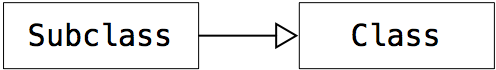
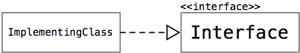
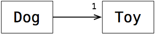
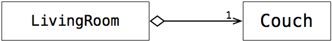

##Software Construction: Object Oriented Design
###0 联想问题记录
1. 很多程序中都使用了异常机制，异常机制时如何提出的，用来解决哪些问题


### 5. Designing Robust Classes
#### 5.0 Long Form Problems :CoffeeMaker Project
**What you will learn about in this project:**

- Designing your own Exception classes
- Extending existing and created Exception classes
- Translating REQUIRES clauses and class invariants into exceptions
- Refactoring specifications to include exceptions
- Throwing exceptions
- Testing exceptions
- Robust method specification, use, testing and implementation

#### 5.1 Module Overview
**Things You'll Learn**

- How to use Exceptions to design programs that can recover from exceptional states. 
- How to test programs that have exceptions
- How to use Assertions in the development stage to discover when your program is behaving improperly

#### 5.2 Introduction to Robust Classes

So if your program is small and there aren't many conditions
to handle, you can get away with that.
But as your program gets larger and there's more conditions
that you might have to deal with, the code can get way too complicated
to have that all interposed together.
So what programming language designers have done over time
is create constructs called exception handling mechanisms
to allow you to separate the regular execution of your code
from these exceptional conditions.
And as a result, we can write larger programs
that are easier to read and maintain.

#### 5.3  What is Robustness?  
- We discuss two ways to increase the robustness of your code: Exceptions and Assertions
- Exceptions are a way to handle exceptional scenarios that happen during execution -- they allow you to specify how to recover execution if things have started to go wrong.  Having code dedicated to handling these exceptional scenarios helps make your code more robust, because you can save it from crashing in these predicted situations. 
- Assertions are checks that are placed within your code to assess whether a class's internal state is consistent with its specification.  Assertions allow you to discover issues with your code, prior to deploying it to users.
If the exception is not caught it keeps falling down the alternate exceptional path until the program effectively crashes

#### 5.4 Exceptions 
##### 5.4.1 Throwing an Exception

**Technical points in this video**

- A call-stack is formed when one method calls another.  If a() called b(), we would see b() stacked on top of a().  We can then say that the return path out of b() would be back down into its calling method, a(). 

- Exceptions are not just error messages. Exception mechanisms in a programming language let us write code to recover from errors, and resume normal execution of the code. 
- Exceptions are objects that are "thrown" by a method. This is done with the keyword throw, and then the construction of a new exception object (new Exception()).  This would look like:
` throw new SomeException();`

- Throwing the exception object causes an alternate return path to be taken: once an exception is thrown, none of the subsequent code in that method is executed.  Instead, the exception object can be thought of as falling back down the return path to the calling method.   
- Normal execution through the normal return path does not resume until the exception is caught.  If the exception is not caught it keeps falling down the alternate exceptional path until the program effectively crashes.


- Exceptions can be caught by a method with the keywords try and catch.  First, we try to call the method by placing the method call within the try's block of code, and if an exception is thrown in that method, then we catch that exception and execute the code in the catch block.
```
try {
    method();
} catch (SomeException e) {
    System.out.println("Never mind let's keep going");
}
```

- A method should only catch an exception if it can actually do the work to recover from (handle) that exception.  If it is not appropriate for the current method to deal with an exception, and recover execution, then it should just pass it along, letting the exception object keep falling down the return path.  In that case, the method would not use the try/catch block.  Instead, the method would be indicated as thrown in the method signature: 

    ```
    public void theMethod() throws SomeException {
        otherMethod();
    }

    private void otherMethod() throws SomeException{
        if(someCondition){
            throw new SomeException();
        }
    }
    ```
    
##### 5.4.2 throwing a Second Exception

**Technical points in this video**


- Exceptions can be thrown from anywhere, including inside of a catch block.

    ```
    try {
        amethod();
    } catch (Exception someException) {
        throw new OtherException();
    }

    ```
- Just like exceptions thrown from elsewhere, no subsequent code in the throwing method executes, instead the exception is thrown out along that separate path, and normal operation does not resume until the exception is caught.  

##### 5.4.3 Finally
**Technical points in this video**

- A Try/Catch statement has a third part: Finally

- The Finally block of code executes either after the catch block (whether an exception was caught or not), or before the method exits if an exception is thrown within the catch block.   

    ```
    try {
        otherMethod();
    } catch (SomeException e) {
        System.out.println("Never mind! We can handle that!");
        throw new AnotherException();
    }
    finally {
        System.out.println("this will print whether SomeException was caught or not");
        System.out.println("Yes, even though AnotherException was thrown");
    }
    ```

##### 5.4.4 Exception Hierarchies
**Technical points in this video**

- Exceptions are regular classes, and as such, one exception can subclass another.  
- If an exception is declared to be caught, as in catch (SuperException supe) {..., any of the subclasses of that exception will also be caught by that same catch statement.
- Exception hierarchies are typically used to provide a standard response to an entire hierarchy of exceptions, while still leaving open the option for catching more concrete exceptions individually as needed.
- Just remember that catches execute in order, so if there was also a catch (SubException sube), you would need to place its catch before that of its super class -- otherwise the exception will get gobbled up before the SubException catch is reached

##### 5.4.5 Unchecked Exceptions
**Technical points in this video**

- Up to now we have been implementing exceptions that are noticed by the compiler -- this is why IntelliJ (or your IDE) complains when you haven't surrounded a method call with try/catch, or haven't added a potentially thrown exception to the method signature.  These are called checked exceptions, because they are checked by the compiler.
- There are also unchecked exceptions.  These are exceptions that the compiler will not complain about, and which do not have to be explicitly listed in a method signature, even if the method potentially throws that exception.  
- An example of an unchecked exception is an ArithmeticException -- the kind of exception you might get if you try to divide by zero.
- Unchecked exceptions are used for errors that could often happen, but rarely do.  For instance, you would not want to have to try/catch every time you use division in a program.  As a corollary to that, division hardly ever produces an error -- and if it does, you can spot that during testing, and perform the necessary checks to ensure it doesn't happen again.
- We can, however, catch unchecked exceptions using the try/catch mechanism, just as we would a checked exception

#### 5.5 Testing Exceptions
**Technical points in this video**
- When testing code that throws exceptions, we want to make sure exceptions are thrown in the right situations
- We devise test cases to exercise the full range of outcomes of the method -- meaning that we want to test all the situations in which we expect an exception to be thrown, and all the situations we expect the exception will not be thrown
- A simple way to test exceptions within a JUnit test is to call a method, and then fail if the exception is caught when it shouldn't be:
```
try {
 anObject.aMethod(nonExceptionalInputs);
} catch (SomeException e) {
 fail("I was not expecting SomeException!");
}
```
-  fail if the exception is not thrown when it should have been:
```
try {
 anObject.aMethod(problematicInputs);
 fail("I was not expecting to reach this line of code!");
} catch (SomeException e) {
 System.out.println("great!");
}
```
#### 5.6 Assertions
**Technical points in this video:**

- Assertions let us programmatically check what should be true at certain points in our program. 
- Assert statements are the same as those used in tests, but they are placed within the code of our class, rather than in an external test class.
- Assertions help us to discover erroneous behaviour in our code.
- By asserting what should be true at the start of a method, and then asserting what should be true at the end of the method, we can ensure that the method has accomplished its work.
- A nice benefit of assertions is that they have access to private data within the class, so checking internal state is very straightforward.
- All the extra code associated with assertions will make your code run more slowly, so we use a compiler option to turn them off when we're deploying the code for use outside of testing.

### 6. Designing Robust Classes
#### 6.0 Long Form Problems : FitLifeGymOOD 

#### 6.1 Module Overview
Design is a critical step of constructing a software system. Good designs solve the problem at hand and exhibit desirable characteristics, such as being evolvable.

In this module we'll talk about extracting design from systems. This will involve using some diagrams that you're familiar with, and some that are completely new, to capture the design of systems - both their architecture, and their behaviour. In the next module we'll do the reverse, and learn how to implement a system based on these types of diagrams. 

Things You'll Learn

- How  to extract the design of an existing system and record it using a UML class diagram.
- The different ways classes can rely on each other including associations, aggregations and dependencies.
- How to extract UML sequence diagrams from existing cod

#### 6.2 Introduction to Extracting and Implementing Object-Oriented Design  

We're going to look at, first, looking at an existing system
and extracting a design from it so that we can think about it at a higher
level of abstraction.
And we're also going to look at when we've
been presented with the design, how we actually realized that in code.

#### 6.3 Extracting Class Hierarchy  

**Technical points in this video:**

- To Extract a class hierarchy we look at all the "extends" and "implements" relationships between classes and interfaces in our system. 
- If one class extends another, then we draw a big arrow from the subclass to the superclass.  This is also true if we have an interface extend another interface (interfaces can extend interfaces!).  We use the same arrow for extends regardless of what type of thing is doing the extending.





- If one class implements an interface, then we draw a big arrow with a dashed line from the implementing class to the interface.

 



- Note that in these diagrams, it is important to include the “interface” and “abstract” annotations to make clear the kind of type for each element. 


So what that means is that we're going to look at some code
and we're going to be extracting three different models from that code.
We're going to extract class hierarchy.
We're going to extract associations.
Associations are the relationships between classes
if they need or depend on one another.
And finally, we're going to look at extracting a sequence diagram, which
is a dynamic diagram of how objects relate to one another
through a certain sequence of execution.

#### 6.4  Extracting Associations
**Technical points in this video:**

- To Extract associations we look at the fields within the classes. 
- If a class contains a field of another type, then we say that the class is associated with that other type.
- We would draw the association on the diagram, and indicate what the arity of the association is (how many of that type, the class has).  For instance, if you had a class Dog, that had one Toy, you would see the field declared in the class as is shown on the left, with the corresponding association in the diagram as shown on the right, with the number 1, clearly marked next to the Toy class. If the Dog had a collection of Toys (like a list, for instance), we would instead have placed a 0..* annotation next to the arrowhead, to indicate an arbitrary number of toys.



```

public class Dog {
    private Toy toy;
}
```

- An Aggregation relationship can be thought of as a whole-part relationship. If one object is part of another object, then we use a diamond at the start of the arrow (next to the containing object), and a normal arrow at the end.  
同生命周期？




#### 6.5 Extracting Sequence Diagrams

**Technical points in this video:**
- A sequence diagram depicts the calls between objects while the system is running.  It’s essentially a vertical timeline of calls, that flows from top to bottom.
- A sequence diagram starts with a particular method call -- so effectively, we are drawing the sequence of calls triggered by one method.  
- At the top of the diagram, all the objects that are “alive” through the execution of the method are depicted.  They then have lifelines (timelines) extending down from them.
To show a method’s execution on the timeline, we draw a box that overlays the timeline.  The box extends for as long as that method runs.  
- Calls to a method are depicted as arrows with the name of the method sitting as the label.  Parameters are listed in parentheses.  The destination object for a call is the object in which that method is implemented.  The call arrow extends from the calling object’s method to the called method.
- We refer to the Object’s name consistently in parameter lists as whatever label is in the Object’s box at the top, even though in the code the name of the object might be changing.  

- Loops are shown in sequence diagram by placing a box around all the looped behaviour, and putting the condition of the loop in the corner.
- Conditional behaviour is shown the same way: a box around all the conditional behaviour, with the condition indicated in the corner.

- Lists are Java objects we often include in sequence diagrams, especially in this course. When checking whether something is in a list, or getting something from a list, we show the calls to the list object itself. So the list object will have its own lifeline, and a call to contains(element) will be shown extending from the caller to the list object, which then returns a boolean with the element. To loop through a list we show the caller getting the next element from the list, if there is one present.

    ```

    public class RegistrationSystem {
        private List<Student> students;

        public void printRecords() {
            for (Student s : students) {
                print(s.getRec());
                // We've added a print
                // statement to consume
                // the String type result
                // of getRec()-- this is
                // different from the
                // drawing in the video.
            }
        }
    }
    ```


### 7. Implementing Object-Oriented Design  
#### 7.1 Implementing Object-Oriented Design
In this module, we will consider how to implement a given OO design, largely by translating a UML class diagram into code

**Things You'll Learn**

- How to express a UML class diagram as a Java program, including expressing associations and aggregations
- How to initialize and set fields that depend on each other
- How to ensure a Java class can be used correctly with the Java Collections Framework by correctly overriding appropriate methods (e.g., equals, hashCode)

####7.2 Implementing Fields  
**Technical points in this video:**

- To Implement Fields we look at associations between classes.

- The type of the field is determined by the destination type of the association arrow.  

The arity of the field (whether it is a collection, a few individual fields, or a single field) is determined by the arity on the association, plus some domain analysis -- would you want, for instance, a list of dog toys, or four individual dog toys (stuffie, squeakie, chewie, and a ball, for instance).   


- If a field is a collection, you need to decide which kind of collection it should be, based on the design problem at hand.  You may want a collection that is... 

 - Fast for searching (Sets)

 - Preserves order of insertion (List)

 - Fast for inserting at the end of the list (Linked List) 

- Two kinds of Lists we have seen are ArrayList and LinkedList.  An ArrayList is contiguous spots in memory, with a reference to the head of the list.  A LinkedList is records that are stored in memory, each with a reference to the next. The LinkedList keeps a reference to the head of the list, and also the tail.

- One kind of Set is a HashSet.  A HashSet is like a table, or dictionary, where there are a sequence of buckets into which elements can be sorted.  The function that determines which bucket an element goes into is called a hash function, or hash() and it is usually based on the values stored inside the object. Each bucket is actually a linked list of elements.  To make sure no linked list gets too long, a large number of buckets is allocated, and the hash function uses prime numbers to reduce the chance of collisions, the situation in which two elements are placed in the same bucket.

- When a field is included in a class, it is typically initialized by the end of the constructor. Typically it takes its value either through instantiating an object of the correct type, or from a parameter passed into the constructor.


####7.4 Implementing Relationships

**Technical points in this video:**

- There are three kinds of **Bi-Directional Relationships**: one-one relationships, one-many relationships, and many-many relationships.
- In each of these relationships, there is typically a design assumption that the association will be maintained programmatically.
- To enforce the reflexive relationship, the setter for the field in one object must call the setter for the field in the other object, passing itself as a parameter. To guard against an infinite sequence, each setter checks whether the work has already been done (whether the other object’s field is already set) before calling the setter.
- This same two-way setter pattern is applied to both individual fields, and collections.


#### 7.5 Implementing Sequence Diagrams
**Technical points in this video:**

- When Implementing Sequence Diagrams begin by looking at the method coming in from the side -- this tells us the name of the method being implemented.
- For each method depicted in the diagram, build a sequence of calls, based on what appears in the diagram.
- Methods are always implemented in the object that is at the arrow head, also called the receiver of the message or the receiver of the method call.  
- Look at the return arrow for clues about the return type of each method.  
- Parameter types must remain as shown in the diagram, but the names within each method can be chosen individually. 
- If a loop box is drawn, place all calls within the loop box into a loop in the implementation.  Make a design choice about what kind of loop to use.
- If a conditional box is drawn, place all calls within the conditional box into a condition (if-statement) in the implementation.


### 8: Design Principles  
#### 7.1 Module Overview
**Things You'll Learn**

- How to use the single-responsibility principle to reduce coupling and increase cohesion in your code
- How to use the Liskov substitution principle to ensure your class hierarchies are creating good design
- How to refactor code to fix design problems and adhere to these design principles

#### 7.2 Introduction to Design Principles  

#### 7.3  What are Design Principles?  

- We introduce the concept of Object-Oriented Design Principles.
- Design principles help guide the way we create software to attain certain very important software qualities, such as maintainability, and readability.  These principles help code to age gracefully.
- We look at two principles out of the collection of OOD principles called SOLID: Single Responsibility, Open-Closed, Liskov Substitution, Interface Segregation and Dependency Inversion. Of those we will look at Single Responsibility and Liskov Substitution.


#### 7,4 Single Responsibility Principle

**Technical points in this video:**


- The Single Responsibility Principle indicates that each class should be centered around one cohesive concept
- When adding new functionality, consider into which class it would best fit
- If, over time, a class seems like it has more than one responsibility, it can be split into two separate classes

- A symptom of having two responsibilities is having multiple clusters of methods, with each cluster referring to their own data within the class.  Each cluster may represent its own responsibility, and may be best separated into its own class.