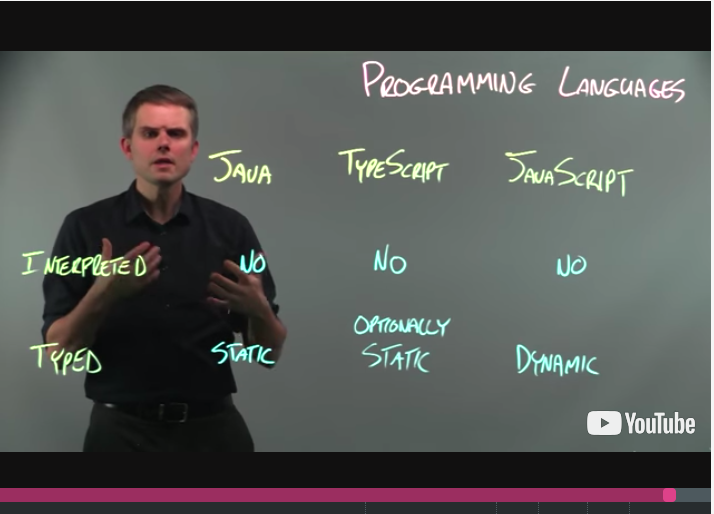
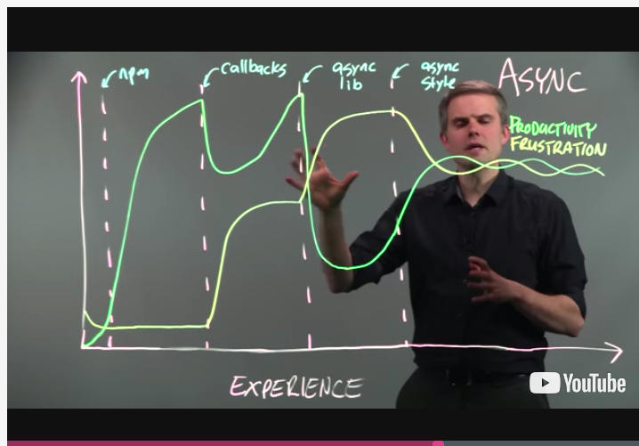
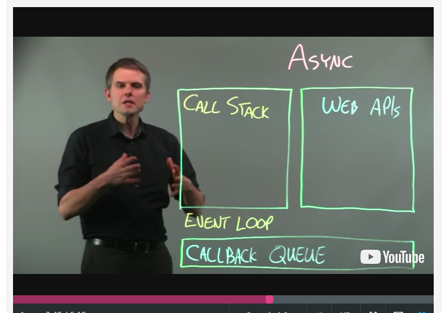
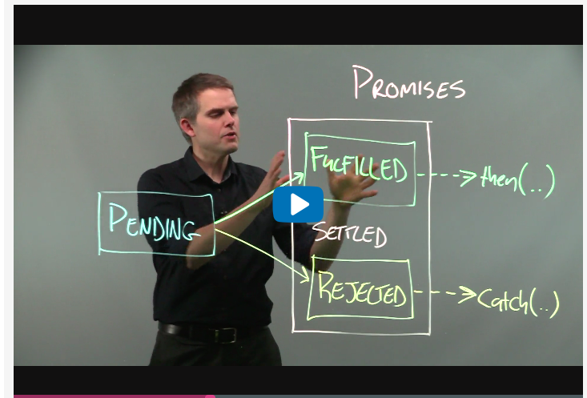

## Software Engineering: Introduction

### 1. Introduction

#### 1.1 Welcome 

- what we're going to do is we're going to look at applying software engineering principles
  to large-scale software development.
- The reason software engineering is important in this space is that software engineering gives us
  guidelines to help us plan, design, implement, test, and evolve these software systems over time.
- What software engineering can do then is to help us to reduce the risks of us building the wrong 
- We have something we need to build a system for.How do we go about doing it?
  - **REQUIREMENTS**: first we need to **capture the requirements**. What is it that we actually want to create?
  - **DESIGN**:Then we need to **come up with a design**. What's the high-level structure of the system that we're going to end up building?
  - **BUILD**:the next thing we need to do is actually **build** it. This is the process of writing the program that will implement our system.
  -  **VALIDATE**:Once the system is written, we need to **validate** it and check to make sure it's actually correct and does what we expected it to do.
  - **DEPLOY**:Once our system is good enough, we'll deploy it and put it in front of users for them to try.
  - **MAINTAIN**:We'll have to continually maintain the system and fix the bugs that those users will report to us.
  - **IMPROVE**:we're also going to need to improve the system.
  - **RESEARCH**:So active research is always happening.

#### 1.2 Running Example Introduction

There are four high level packages within the Mario game.

1. The first is the Figures package, which contains all of the elements that move about screen,like Mario and the other enemies.
2. Next we have the Items package, which contains the elements that Mario actually interacts with, like coins, stars, and mushrooms.

3. Then there's the Matter package which contains the other elements that are in the screen, but that Mario doesn't interact with,like the landscape elements that stop Mario from moving in specific directions.
4. Finally, there's the Engine package, which contains the level and main code, which binds together the other elements within the game and makes it executable.

### 1.3 Programming Language Introduction

#### 1.3.1 Programming Language Introduction

- **the fluid nature of software systems requires that you get used to quickly learning new languages, frameworks, and tools.**

- TypeScript has many great resources, but the [TypeScript Handbook](http://www.typescriptlang.org/docs/handbook/basic-types.html) or the [TypeScript Deep Dive](https://basarat.gitbooks.io/typescript/content/docs/getting-started.html) would be good places to start
- If you are starting from scratch, it is really important that you do not just read a bunch of code but actually write some. The [TypeScript Playground](http://www.typescriptlang.org/play/index.html) or a [JavaScript REPL](https://repl.it/languages/javascript) can be a lightweight way to do this.

- the whole process of programming is about taking your idea and transforming it into a format that the computer can understand and execute.

So let's take a look at a couple of those now to see what some common different design points on that spectrum are.

1. A language's syntax defines its grammar.

2. Languages often have their own idioms as well.These are commonly used patterns that arise often when developing using a particular language.

   1. One example of an idiom is to only use exceptions to actually signal exceptional circumstances.

   2. Another example is immutability.

      - That is, for its internal state to state the same.This can make it much easier to understand how your program is running,
      - especially in multi-threaded environments where an object could be mutated otherwise by many different programs' needs concurrently.

3. When working with a language, we should also remain aware of the difference between the static representation of the code, that is what all the text says, and how it executes dynamically at runtime.
4. One common language feature is whether the language is interpreted or compiled.
5. Another common language design dimension is whether the language is statically typed or dynamically typed.

​      

#### 1.3.2 Introduction to Concurrency and Asynchronous Development: Part 1

- Concurrency and asynchronous development are two techniques for increasing the performance of our systems that are widely used today.
- Concurrent programs are able to execute multiple parts of a program simultaneously.
  - This can lead to all kinds of program problems like deadlock, live lock, and resource starvation,
- Learning to use asynchronous API's and write your code in a way that works well with other asynchronous bits of code is quite hard to do in practice.

- TypeScript of JavaScript are single threaded, non-blocking, asynchronous programming languages.

#### 1.3.3 Introduction to Concurrency and Asynchronous Development: Part 2

1. At the core of how TypeScript and JavaScript deal with this asynchronous callback model is, of course, the callback itself. **SetTimeout** is the most common and probably simplest asynchronous API that you'll encounter in regular use.

2. One thing to keep in mind when we're working with callbacks is they don't always have to be asynchronous.

3. One common idiom for callbacks that you will encounter in TypeScript and JavaScript is called the error of first idiom. This allows us to let a callback function no if the caller encountered some kind of a problem.

4. While callbacks may seem confusing, understanding how they're actually executed at runtime can help us to appreciate why they were designed the way that they were.

   

#### 1.3.4 Introduction to Concurrency and Asynchronous Development: Part 3

- Callback-based async development has two major shortcomings.

  1. The first is callback hell. Dealing with these long-nested sets of callbacks makes it really hard to look at the code and understand what's actually going to happen at runtime.
  2. The second is that callbacks don't allow us to use the native exception handling mechanism that's built into the language.
  3. Promises solve both of these problems.

- promise

  - A promise is an object that can exist in two states, either pending or settled. Further, this settled state can be split into two sub-states, which are fulfilled and rejected.
  - 

  

  - Now one important thing to realize about promisesis they can only transition from pending to settled once,and only in that one direction.So you can transition from pending to fulfilled or pending to rejected, but that's it.You can't traverse from rejected to fulfilled. You can't go from fulfilled back to fulfilled.**And you can never move backwards to being pending.**

- How can we take advantage of this promise mechanism to make our code easier to understand?

1. And in this way we're able to actually avoid callback hell, because thisis still a linear reading of the code. And we can handle exceptions appropriately.

### 2. Process  