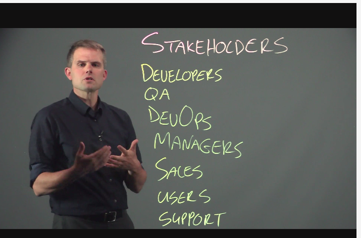
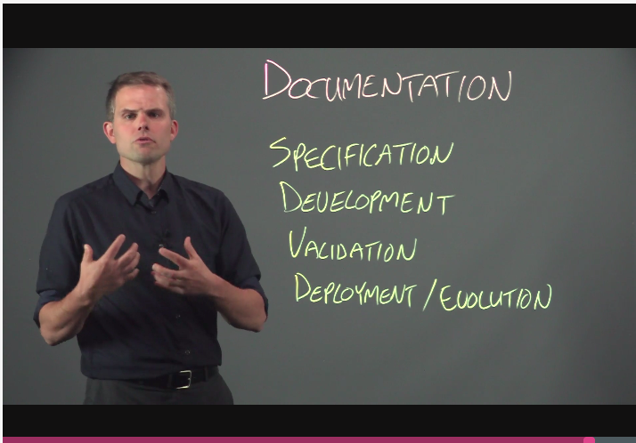
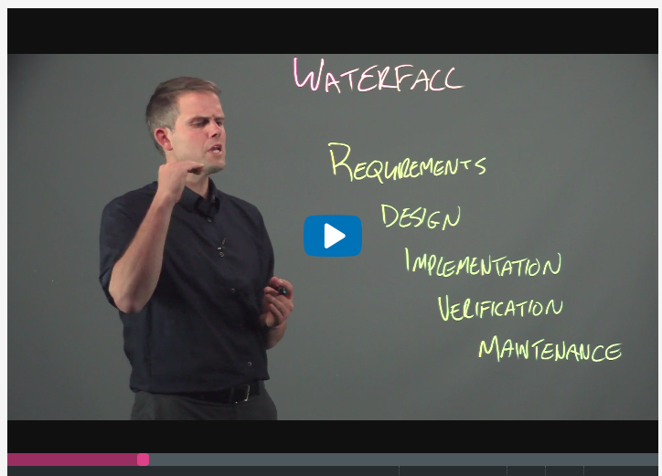
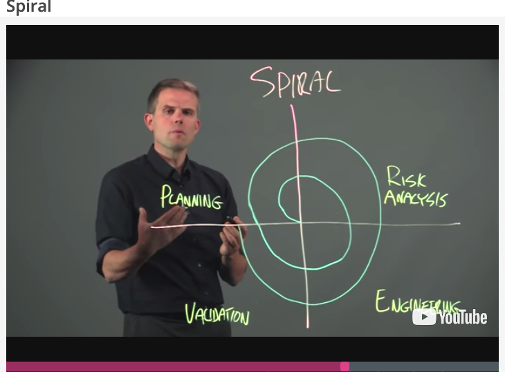
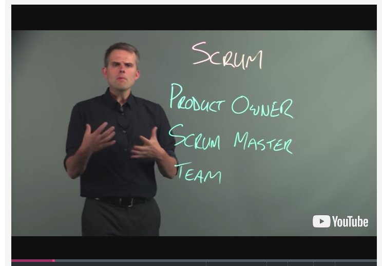
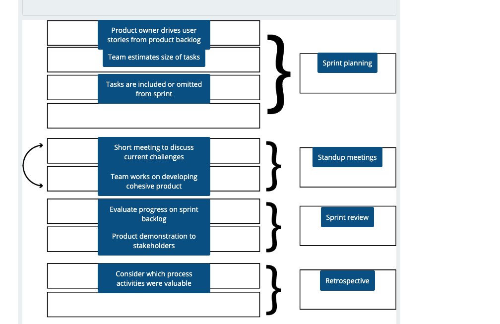

## Software Engineering: Introduction

### 1. Introduction

#### 1.1 Welcome 

- what we're going to do is we're going to look at applying software engineering principles
  to large-scale software development.
- The reason software engineering is important in this space is that software engineering gives us
  guidelines to help us plan, design, implement, test, and evolve these software systems over time.
- What software engineering can do then is to help us to reduce the risks of us building the wrong 
- We have something we need to build a system for.How do we go about doing it?
  - **REQUIREMENTS**: first we need to **capture the requirements**. What is it that we actually want to create?
  - **DESIGN**:Then we need to **come up with a design**. What's the high-level structure of the system that we're going to end up building?
  - **BUILD**:the next thing we need to do is actually **build** it. This is the process of writing the program that will implement our system.
  -  **VALIDATE**:Once the system is written, we need to **validate** it and check to make sure it's actually correct and does what we expected it to do.
  - **DEPLOY**:Once our system is good enough, we'll deploy it and put it in front of users for them to try.
  - **MAINTAIN**:We'll have to continually maintain the system and fix the bugs that those users will report to us.
  - **IMPROVE**:we're also going to need to improve the system.
  - **RESEARCH**:So active research is always happening.

#### 1.2 Running Example Introduction

There are four high level packages within the Mario game.

1. The first is the Figures package, which contains all of the elements that move about screen,like Mario and the other enemies.
2. Next we have the Items package, which contains the elements that Mario actually interacts with, like coins, stars, and mushrooms.

3. Then there's the Matter package which contains the other elements that are in the screen, but that Mario doesn't interact with,like the landscape elements that stop Mario from moving in specific directions.
4. Finally, there's the Engine package, which contains the level and main code, which binds together the other elements within the game and makes it executable.

### 1.3 Programming Language Introduction

#### 1.3.1 Programming Language Introduction

- **the fluid nature of software systems requires that you get used to quickly learning new languages, frameworks, and tools.**

- TypeScript has many great resources, but the [TypeScript Handbook](http://www.typescriptlang.org/docs/handbook/basic-types.html) or the [TypeScript Deep Dive](https://basarat.gitbooks.io/typescript/content/docs/getting-started.html) would be good places to start
- If you are starting from scratch, it is really important that you do not just read a bunch of code but actually write some. The [TypeScript Playground](http://www.typescriptlang.org/play/index.html) or a [JavaScript REPL](https://repl.it/languages/javascript) can be a lightweight way to do this.

- the whole process of programming is about taking your idea and transforming it into a format that the computer can understand and execute.

So let's take a look at a couple of those now to see what some common different design points on that spectrum are.

1. A language's syntax defines its grammar.

2. Languages often have their own idioms as well.These are commonly used patterns that arise often when developing using a particular language.

   1. One example of an idiom is to only use exceptions to actually signal exceptional circumstances.

   2. Another example is immutability.

      - That is, for its internal state to state the same.This can make it much easier to understand how your program is running,
      - especially in multi-threaded environments where an object could be mutated otherwise by many different programs' needs concurrently.

3. When working with a language, we should also remain aware of the difference between the static representation of the code, that is what all the text says, and how it executes dynamically at runtime.
4. One common language feature is whether the language is interpreted or compiled.
5. Another common language design dimension is whether the language is statically typed or dynamically typed.

​      

#### 1.3.2 Introduction to Concurrency and Asynchronous Development: Part 1

- Concurrency and asynchronous development are two techniques for increasing the performance of our systems that are widely used today.
- Concurrent programs are able to execute multiple parts of a program simultaneously.
  - This can lead to all kinds of program problems like deadlock, live lock, and resource starvation,
- Learning to use asynchronous API's and write your code in a way that works well with other asynchronous bits of code is quite hard to do in practice.

- TypeScript of JavaScript are single threaded, non-blocking, asynchronous programming languages.

#### 1.3.3 Introduction to Concurrency and Asynchronous Development: Part 2

1. At the core of how TypeScript and JavaScript deal with this asynchronous callback model is, of course, the callback itself. **SetTimeout** is the most common and probably simplest asynchronous API that you'll encounter in regular use.

2. One thing to keep in mind when we're working with callbacks is they don't always have to be asynchronous.

3. One common idiom for callbacks that you will encounter in TypeScript and JavaScript is called the error of first idiom. This allows us to let a callback function no if the caller encountered some kind of a problem.

4. While callbacks may seem confusing, understanding how they're actually executed at runtime can help us to appreciate why they were designed the way that they were.

   

#### 1.3.4 Introduction to Concurrency and Asynchronous Development: Part 3

- Callback-based async development has two major shortcomings.

  1. The first is callback hell. Dealing with these long-nested sets of callbacks makes it really hard to look at the code and understand what's actually going to happen at runtime.
  2. The second is that callbacks don't allow us to use the native exception handling mechanism that's built into the language.
  3. Promises solve both of these problems.

- promise

  - A promise is an object that can exist in two states, either pending or settled. Further, this settled state can be split into two sub-states, which are fulfilled and rejected.
  - 

  

  - Now one important thing to realize about promisesis they can only transition from pending to settled once,and only in that one direction.So you can transition from pending to fulfilled or pending to rejected, but that's it.You can't traverse from rejected to fulfilled. You can't go from fulfilled back to fulfilled.**And you can never move backwards to being pending.**

- How can we take advantage of this promise mechanism to make our code easier to understand?

1. And in this way we're able to actually avoid callback hell, because thisis still a linear reading of the code. And we can handle exceptions appropriately.

### 2. Process  

#### 2.1 Module Overview

- we will explore how software development processes can help structure the diverse set of activities involved in building modern systems

- While learning about several common processes used in industry, we will discuss the benefits and drawbacks of each approach, as well as how to choose the best process for your specific team and project.

 Learning Goals

- Learn about the different types of stakeholders and the types of documentation they use to communicate during the software development process
- Learn about Traditional software processes, including Waterfall and Spiral approaches
- Learn about more modern Agile software processes, including Extreme Programming, Test Driven Development, and Scrum methodologies

#### 2.2 Why Process?

Software processes are a mechanism for us to structure the diverse set of activities that are involved in building modern software systems, because our ultimate goal is to **build a successful and maintainable system** that will be used for years to come in the future. So when we think about structuring the process for our system, we want to think about it in terms of these simple dimensions.

1. we want to think about what are we actually trying to build.？

2. we want to consider who is going to be doing the building？Who are the people involved in this whole software development process?

3. Next, we want to think about how are these different teams going to coordinate with each other? How are they going to actually build the system?

4. And finally, of course, we need a timeline, because ultimately,**we want to ship our software.**

Building software systems involves the collaboration and cooperation of a wide variety of projects stakeholders.

Each product stakeholder is going to need a different form of documentation in order to communicate effectively and concretely with one another.

#### 2.3 Traditional Processes: Waterfall and Spiral 

##### 2.3.1 Waterfall 

1. Now one thing that's really important to note is that there is no one true process.The process that any team chooses to follow is going to vary based on their own constraints,experience, and what needs to happen within the product itself.

2. In the Waterfall model, what we're going to do is we're going to go from one step to the next to the next in the development process without ever stepping back. So we want to make sure that each step is finished to completion before we carry on with the next phase of the project.
3. Now, one huge downside of this process is it's not until we get to the very end that we know that the system that we've built is actually useful in practice.
4. One other challenge of the Waterfall model is that the resistance to moving back to a previous stage can be really problematic in practice.So the Waterfall model is extremely resistant to change in practice.
5. Because all of the phases in the Waterfall model are extremely distinct, it's really easy to understand what's actually happening in the development of the system at any given time.

##### 2.3.2 Spiral

1.The spiral methodology emerged in the 1980s as a direct response to some of the shortcomings of more traditional waterfall based development strategies.

2. This is, again, a direct response to the shortcomings in waterfall where we want to go and collect this customer feedback along the way to make sure that we're actually building the right product, which is a huge, huge risk to many software products.

3. two shortcomings 

   1. The first is that effectively documenting the risk analysis process can be quite overwhelming.
2. The next is that waiting for customer feedback for a whole year at a time can also really slow down the development process by delaying feedback that a customer could have given, essentially,right away.
  

#### 2.4 Agile Processes: XP and TDD  

##### 2.4.1 Extreme Programming

1.Agile methodologies emerged in the early 2000s as a direct response to more traditional development methodologies. **Agile methodologies are really all about tightening the feedback loop between the development team and customers.** Enabling developers to be more flexible and achieve higher development velocity.

2. The other great thing about agile methodologies is they increase development velocity by decreasing the amount of time that development teams spend building the wrong thing. And the reason we avoid building the wrong thing is again by having the customers in the loop, and giving us feedback along the way.
3. This also allows development teams to experiment more by trying different design alternatives and figuring out which ones work best for the customer. So it gives the developers a little bit more flexibility to try different things out and see how they work in practice.
4. At its core, extreme programming was all about having a billable system at all times.So the development team would start really small and slowly grow their system over time in response to customer feedback. And this is in contrast to the more traditional approaches where we started upfront with a huge planning effort in the beginning and built our systems from the top down.

5. Systems that are built with XP follow five key principles.

   

##### 2.4.2 Test Driven Development

#### 2.5 Agile Processes: Scrum  

##### 2.5.1 Scrum

1. Scrum-based methodologies represent the most common form of Agile methodology used in practice today. In Scrum, we have a product backlog, which represents all of the issues— those are features and bugs— that remain to be fixed for a product. And then we work through a series of sprints that are usually one to three weeks long. In each sprint, we're working on what's known as the sprint backlog.So this is a subset of the product backlog, which contains just those specific issues that we want to work on in the individual sprint.
2. all Scrum-based teams do have these three high level stakeholder roles.

   - first, we have the product owner. The product owner is the person who acts as the proxy for the client, or is the client themselves.So their primary role is to prioritize issues that are being worked on in a sprint, and to evaluate the team's output to make sure that the work they've made on specific issues
   - Next, we have the Scrum Master. The Scrum Master's job is to manage the development process. So they're not the manager of the team, but they're the manager of the process. They make sure that the team is on track, and is working specifically on the issues for that sprint that the product owner has prioritized as being important.
   - And finally, we have the team themselves. So Scrum-based teams are typically five to seven people,and span a variety of disciplines. So we might have developers, QA, and ops all on the same Scrum team, working together to build a product. 

## 

### 3. Specifications  

#### 3.1 Module Overview

**Learning Goals:**

- Learn how specifications help customers and software engineering teams communicate about software development projects
- Learn about the process of gathering and validating requirements
- Learn how user stories are commonly used as specifications in practice
- Learn how to generate high quality user stories that adhere to the INVEST design guidelines

#### 3.2 Introduction to Specifications

1. The specification of the software system is one of the most important documents to connect the customer and the engineering team.